# HARES Architecture

HARES (Home energy Analysis and Residential Energy Simulation) is a high-fidelity residential building energy simulator written in Rust with Python bindings. It models thermal dynamics, HVAC equipment, distributed energy resources, and occupant schedules at sub-minute resolution.

## Workspace & Crate Dependency Graph

HARES is organized as a Rust workspace with 9 crates arranged in a strict DAG:

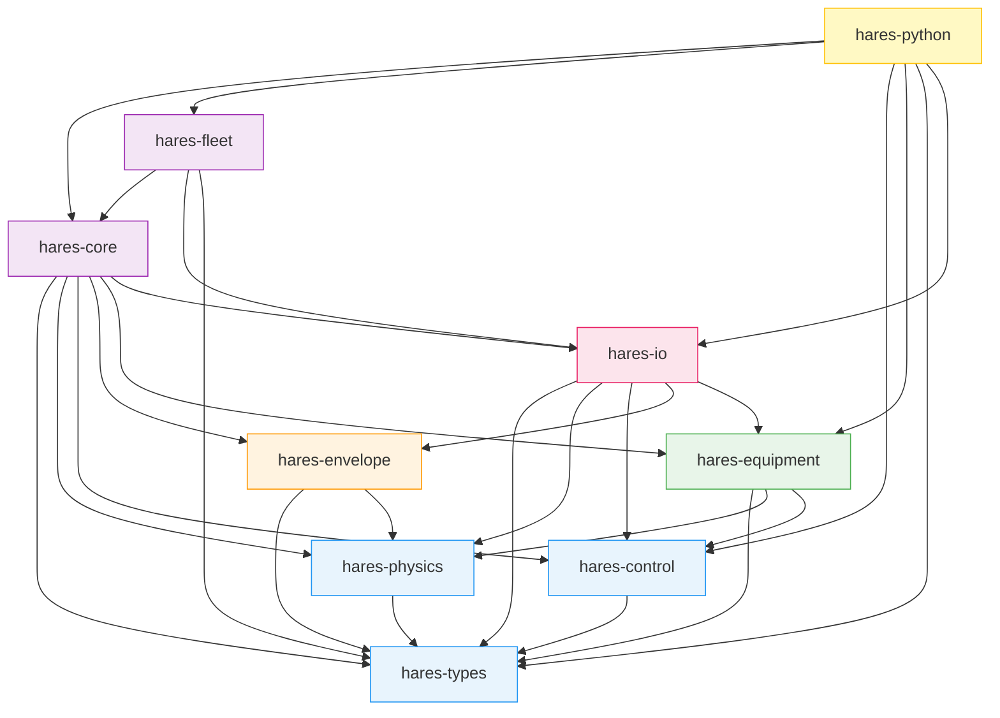

| Crate | Role |
|-------|------|
| **hares-types** | Leaf dependency. Shared types: `EnvironmentState`, `PortContribution`, `PortSlots`, `ControlSignal`, `DomainSolver` trait, error types |
| **hares-physics** | Pure physics: psychrometrics, solar position, Perez irradiance, infiltration (ASHRAE 152), film coefficients, mains water temperature |
| **hares-control** | Control signal definitions, capability bitflags, dispatch routing |
| **hares-envelope** | RC thermal network, state-space discretization, thermal/humidity/electrical/fluid domain solvers |
| **hares-equipment** | `Equipment` trait + implementations: HVAC, battery, PV, water heater, EV, generators, scheduled/event loads |
| **hares-io** | I/O parsers: HPXML building geometry, EPW weather, CSV schedules, ResStock metadata, defaults/LUT, Arrow output |
| **hares-core** | Dwelling orchestrator, simulation engine, environment manager, clock, checkpointing |
| **hares-fleet** | Parallel multi-dwelling simulation via Rayon, aggregation, progress tracking |
| **hares-python** | PyO3 bindings: `PyDwelling`, `PyFleet`, DataFrame conversion, RL gym interface |

---

## Core Architectural Pattern: Environment / Config / Port Decoupling

The central design principle is **strict separation** between environment observation, equipment behavior, and inter-component communication. No component directly references another; all interaction flows through three typed interfaces:

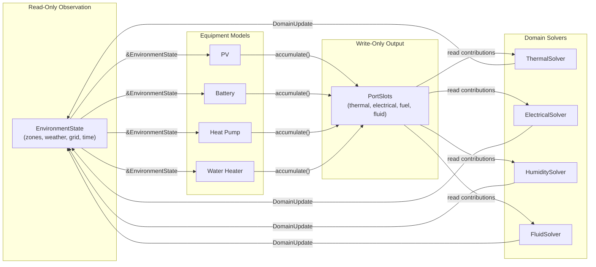

### EnvironmentState (Immutable Input)

Every equipment model and solver receives the same read-only snapshot each timestep:

```rust
pub struct EnvironmentState {
    pub zones: Vec<ZoneState>,              // indoor temp, humidity, volume per zone
    pub weather: WeatherState,              // outdoor conditions, solar irradiance per surface
    pub grid: GridState,                    // voltage, frequency
    pub custom_domains: Vec<DomainUpdate>,  // solver outputs from previous step
    pub current_time: DateTime<FixedOffset>,
    pub time_res: Duration,
}
```

Equipment never knows about file formats (HPXML, EPW). The `EnvironmentManager` in `hares-core` is the sole producer, consuming parsed weather/schedule data and computing derived fields (wet-bulb, mains water temp, solar position).

Full weather pipeline details — EPW parsing, sub-hourly resampling, solar position, Perez tilted irradiance, psychrometrics, and mains water temperature:

| Topic | Document |
|-------|----------|
| Weather ingestion, derived quantities, per-timestep state construction | [Weather Pipeline](weather-pipeline.md) |

### PortSlots (Typed Accumulator Bus)

Equipment writes contributions via a push model. Solvers read accumulated totals.

```rust
pub enum PortContribution {
    Thermal  { zone, sensible_gain_w, latent_gain_w, category },
    Electrical { active_power_kw, reactive_power_kvar },
    Fuel     { fuel_type, consumption_w },
    Fluid    { loop_id, flow_rate_kg_s, supply_temp_c, return_temp_c, fluid_type },
    Custom   { domain_id, payload: [f64; 16] },
}
```

`PortSlots` pre-allocates accumulators at init from equipment port declarations. Per-zone thermal accumulators track category breakdowns (HVAC heating, HVAC cooling, internal gains, jacket loss, duct loss) in fixed-size arrays to avoid hot-path allocation.

### ControlSignal (Capability-Gated Dispatch)

External controllers (Python, RL agents) push `DispatchRequest` objects into a queue. Each request targets equipment by name or end-use and carries a typed signal:

```rust
pub enum ControlSignal {
    ThermalSetpoint   { heating_setpoint_c: Option<f64>, cooling_setpoint_c: Option<f64>, deadband_c: Option<f64> },
    HumiditySetpoint  { target_rh: f64, min_rh: Option<f64>, max_rh: Option<f64> },
    PowerSetpoint     { active_power_kw: f64, reactive_power_kvar: Option<f64> },
    PowerLimit        { max_power_kw: f64, ramp_rate_kw_per_s: Option<f64> },
    SOCTarget         { target_soc: f64, min_soc: Option<f64>, max_soc: Option<f64> },
    ModeOverride      { mode: OperatingMode },
    DutyCycle         { on_fraction: f64, period_s: Option<f64> },
    LoadFraction      { fraction: f64 },
    CurtailmentPercent { percent: f64 },
    ReactiveSetpoint  { kvar: f64 },
    PowerFactorSetpoint { power_factor: f64 },
    InverterPriorityMode { priority: InverterPriority },
    ProtocolNative    { protocol: ProtocolId, payload: Vec<u8> },
    GridConnect        { connected: bool },
    SelfConsumption    { enabled: bool, solar_only_charging: bool },
    DemandResponse     { level: DRLevel, duration_s: Option<f64> },
}
```

Equipment declares `ControlCapabilities` bitflags. The `apply_control()` method validates the signal against capabilities before dispatching to `apply_control_unchecked()`.

---

## Equipment System

### Equipment Trait

All equipment implements a single object-safe trait enabling heterogeneous `Vec<Box<dyn Equipment>>`:

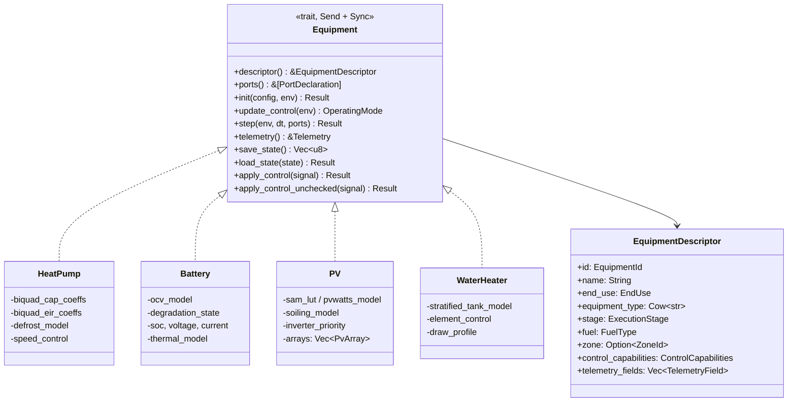

### Execution Stages

Equipment is sorted into stages that enforce causal ordering:

| Stage | Equipment | Rationale |
|-------|-----------|-----------|
| `Independent` | PV, scheduled loads, event loads | No dependency on other equipment output |
| `Electrical` | Battery, EV, generator | Depends on net electrical state from independent equipment |
| `Thermal` | HVAC, water heater, dehumidifier | Depends on zone temperatures and electrical state |

### Equipment Registry

A factory pattern maps OCHRE class strings to constructor functions:

```rust
type EquipmentFactory = Box<dyn Fn(EquipmentConfig) -> Box<dyn Equipment> + Send + Sync + 'static>;

pub struct EquipmentRegistry {
    factories: HashMap<String, EquipmentFactory>,
}
```

Equipment is instantiated dynamically from HPXML-derived `EquipmentSpec` entries during dwelling construction.

### Equipment Type Documentation

Detailed per-equipment documentation covering internal physics models, port interactions, control signal handling, and telemetry:

| Equipment | Document |
|-----------|----------|
| Heat Pump, Furnace, Boiler, AC, Thermostat, Dehumidifier, Baseboard | [HVAC Equipment](equipment/hvac.md) |
| Battery (OCV, degradation, thermal) | [Battery](equipment/battery.md) |
| PV (SAM-NOCT, soiling, inverter control) | [PV](equipment/pv.md) |
| Water Heater (resistance, gas, HPWH, tankless) | [Water Heater](equipment/water-heater.md) |
| EV Charger (archetypes, V2L, charging curves) | [EV Charger](equipment/ev.md) |
| Generator / Fuel Cell (CHP, ramp control) | [Generator](equipment/generator.md) |
| Scheduled Load, Event-Driven Load | [Loads](equipment/loads.md) |
| Control System, OpenADR/DR, OCHRE compat | [Control System](equipment/control-system.md) |
| Envelope: HPXML -> RC network -> state-space | [Envelope Construction](equipment/envelope-construction.md) |
| OCHRE parity gap analysis | [OCHRE Parity Gaps](equipment/ochre-parity-gaps.md) |

---

## Simulation Loop

Each timestep follows a strict multi-phase pipeline:

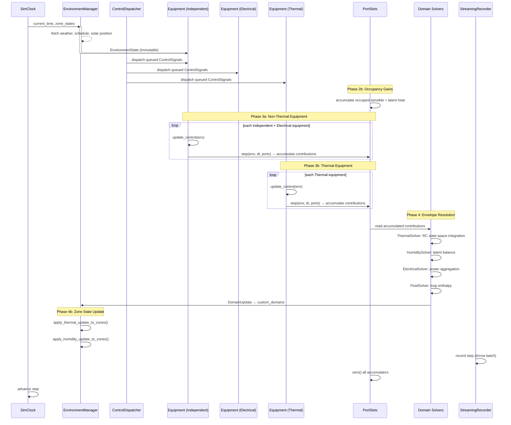

### Phase Detail

1. **Environment Update** -- `EnvironmentManager` reads weather/schedule at current offset, computes solar position via Perez model, derives psychrometric state, produces fresh `EnvironmentState`
2. **Control Dispatch** -- Dequeues `DispatchRequest` items, routes by name or end-use, calls `apply_control()` with capability gating
3. **Occupancy Gains** -- Accumulates occupant-driven sensible and latent heat into `PortSlots` thermal accumulators before equipment runs
4. **Equipment Execution** -- Stage-ordered: Independent, then Electrical, then Thermal. Each calls `update_control()` then `step()`, writing contributions to `PortSlots`
5. **Envelope Resolution** -- Domain solvers read port accumulations, solve physics, return `DomainUpdate` with new zone temperatures, humidity, power state. Zone states are then updated via `apply_thermal_update_to_zones()` and `apply_humidity_update_to_zones()` as separate operations
6. **Output Recording** -- `StreamingRecorder` buffers rows into Arrow `RecordBatch`, flushes to Parquet/CSV at configurable chunk sizes

### Invariants & Observability

Conservation-law invariant checks, the zero-cost observer system for deep step-level debugging, and diagnostic CSV output are documented separately:

| Topic | Document |
|-------|----------|
| Invariant checks, observer system, diagnostic output, debugging workflows | [Invariants & Observability](invariants-and-observability.md) |

---

## Building Information Model (BIM)

### HPXML Parsing Pipeline

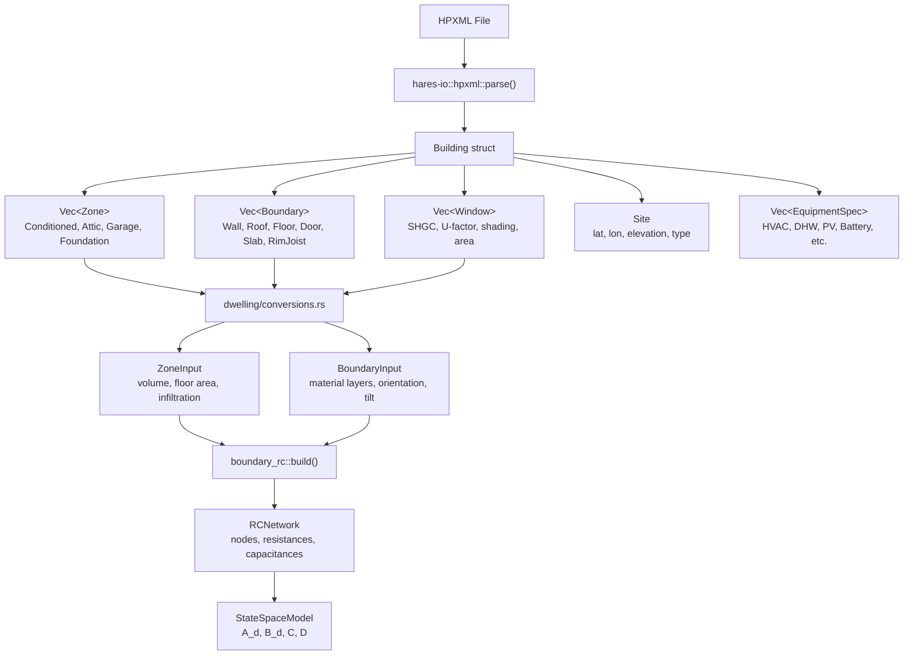

### Zone Model

Zones are thermal volumes identified by `ZoneId(u16)`:
- **Primary zone** (`ZoneId(1)`): conditioned living space
- **Secondary zones**: attics, basements, garages, crawlspaces
- **Outdoor** (`ZoneId(0)`): boundary condition

Each zone carries temperature, humidity ratio, relative humidity, wet-bulb temperature, and volume.

### Boundary & Surface Representation

Each boundary is a 1D heat-conduction chain with material layers:

```
Exterior Film → [Material Layer 1] → [Material Layer 2] → ... → Interior Film → Zone Air
  R_ext            R₁, C₁              R₂, C₂                    R_int
```

Material layers store conductivity (W/m-K), density (kg/m³), specific heat (J/kg-K), and thickness (m). Exterior surfaces carry solar absorptance, longwave emissivity, tilt, and azimuth for solar/LWR calculations.

---

## Thermal State Solver

The envelope is modeled as a lumped-parameter RC (resistance-capacitance) network discretized into a linear time-invariant (LTI) state-space system.

### RC Network Construction

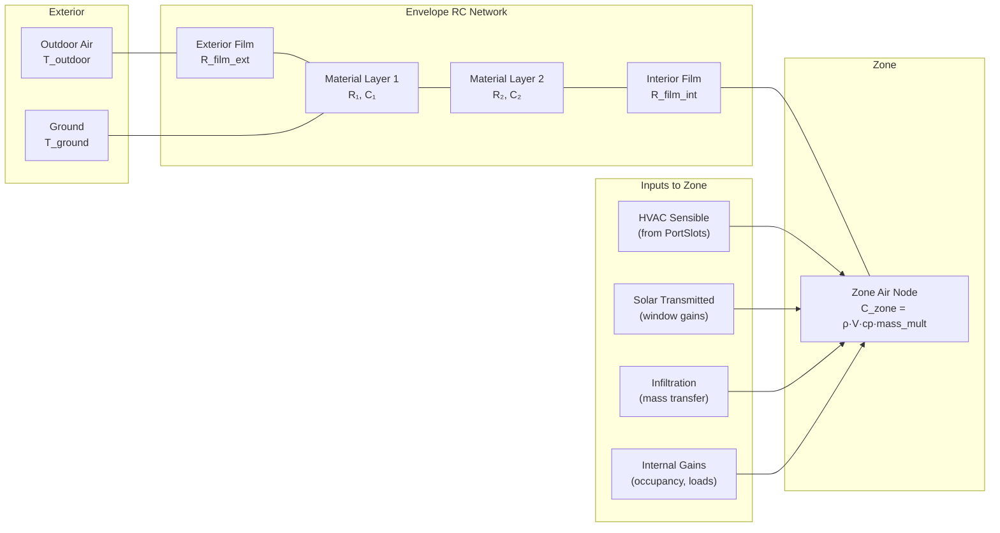

**Key construction details:**
- Zone air capacitance includes a 7x interior mass multiplier for thermal storage
- Minimum capacitance floor of 1000 J/K prevents near-singularity
- Parallel resistances are combined: `R_parallel = (R₁·R₂)/(R₁+R₂)`
- Minimum capacitance clamping (`MIN_CAPACITANCE_J_K = 1000 J/K`) prevents degenerate nodes
- Pre-computed RC layers from OCHRE material database take priority over raw material properties

### State-Space Discretization

The continuous-time RC network `(A_c, B_c)` is discretized to `(A_d, B_d)` for numerical integration:

```
Continuous:  dx/dt = A_c·x + B_c·u
Discrete:    x[k+1] = A_d·x[k] + B_d·u[k]
Output:      y[k] = C·x[k] + D·u[k]
```

**Discretization methods:**
1. **Primary (ZOH):** `A_d = exp(A_c·dt)`, `B_d = A_c⁻¹·(A_d - I)·B_c` via LU factorization
2. **Fallback (Van Loan):** For singular `A_c`, uses augmented block-matrix exponential to avoid explicit inversion

Matrix exponential uses 13th-order Pade scaling-and-squaring approximation. Eigenvalue stability is checked for small networks (n <= 20): continuous Re(lambda) < 0, discrete |lambda| < 1.

### Thermal Solver Resolution (per timestep)

The `ThermalSolver::resolve()` method builds the input vector `u[k]` from multiple sources:

1. **Outdoor boundary conditions** -- dry-bulb temperature, ground temperature
2. **Exterior solar gains** -- per-surface absorbed solar (Perez tilted irradiance x absorptance x area)
3. **Exterior longwave radiation** -- iterative convergence with heavy-ball damping (0.5 relaxation + 0.1 momentum)
4. **Interior longwave radiation** -- linearized radiative exchange: `h_r = 4·epsilon·sigma·T_avg³`
5. **Window transmitted solar** -- beam + diffuse with EnergyPlus IAM correction per glazing
6. **Infiltration & ventilation** -- ASHRAE wind-stack model, ELA, or ACH method; HRV/ERV recovery
7. **Equipment sensible contributions** -- from `PortSlots` thermal accumulators
8. **Ideal HVAC** -- optional back-calculation of capacity needed to hold setpoint

Integrates `x[k+1] = A_d·x[k] + B_d·u[k]` and extracts zone temperatures via output mapping `y = C·x`.

Full implementation details — RC construction, discretization, per-timestep resolve flow, and planned improvements:

| Topic | Document |
|-------|----------|
| Thermal solver implementation, input application, planned Crank-Nicolson migration | [Thermal Envelope Solver](thermal-envelope-solver.md) |

---

## Domain Solver Extensibility

All physics solvers implement a common trait, allowing custom domains to be injected at runtime:

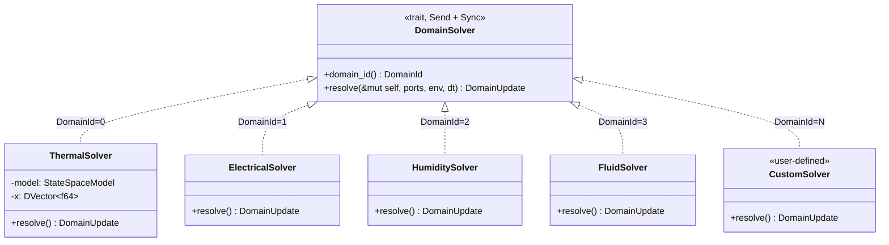

Each solver returns a `DomainUpdate` containing zone state changes and optional custom payloads. Updates feed back into `EnvironmentState.custom_domains` for the next timestep.

---

## Fleet Simulation

`hares-fleet` enables parallel simulation of building portfolios:

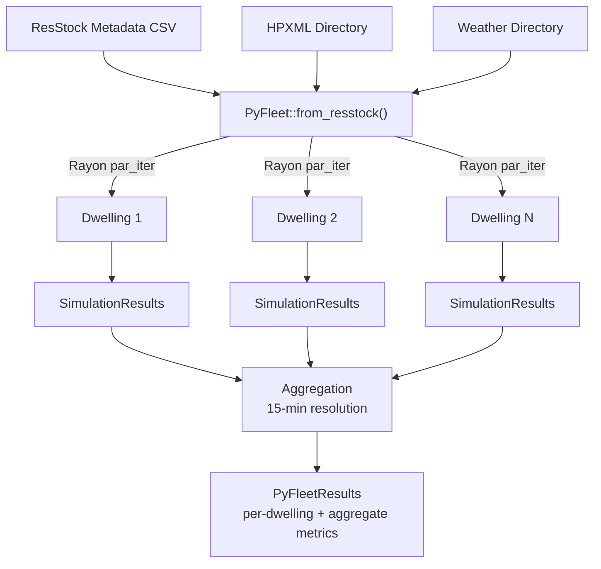

Individual dwellings are fully independent (no shared mutable state), enabling linear scaling with Rayon thread pools.

---

## Python Interface

PyO3 bindings expose three interaction modes:

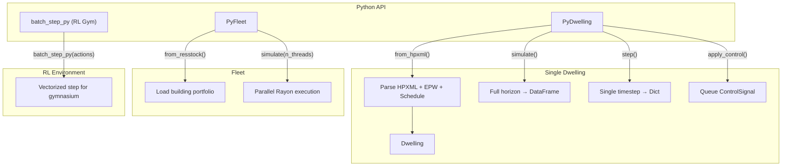

| Method | Description |
|--------|-------------|
| `PyDwelling.from_hpxml(hpxml, schedule, weather, **kwargs)` | Construct dwelling from file paths |
| `PyDwelling.simulate()` | Run full simulation horizon, return Polars DataFrame |
| `PyDwelling.step()` | Advance one timestep, return telemetry dict |
| `PyDwelling.apply_control(name, signal)` | Queue control signal for next step |
| `PyFleet.from_resstock(metadata, hpxml_dir, weather_dir)` | Load building portfolio |
| `PyFleet.simulate(n_threads)` | Parallel simulation with aggregated results |

---

## Data Flow Summary

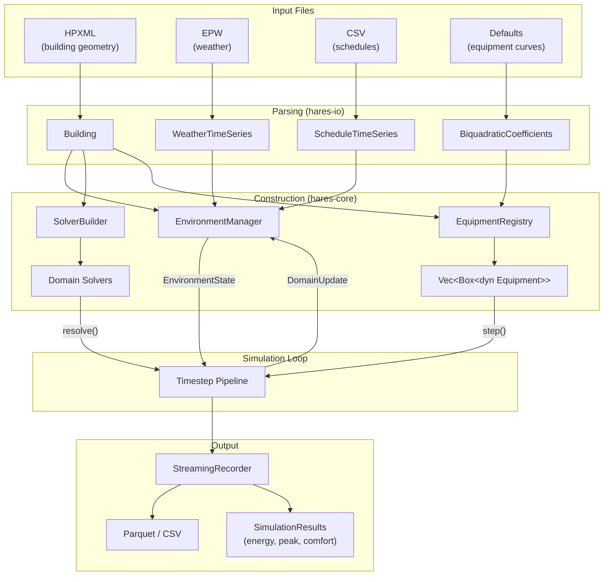

---

## Hot-Path Memory & Performance Architecture

The simulation loop executes ~525,600 timesteps per simulated year (at 60s resolution). Every per-timestep allocation compounds into significant overhead at fleet scale. HARES uses a combination of **pre-allocated buffer reuse**, **zero-copy indexed access**, and **lazy iteration** to achieve near-zero allocation in the hot path.

### Thermal Solver: Buffer Swap Pattern

The thermal solver owns pre-allocated `DVector<f64>` buffers for the state-space input vector `u[k]` and previous input `last_u`:

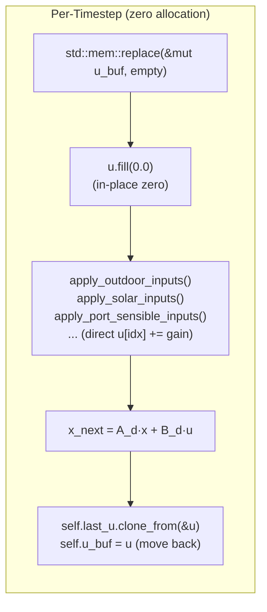

- `u_buf` is **swapped out** via `std::mem::replace()` (move semantics, no copy)
- Zeroed in-place with `fill(0.0)` rather than allocating a new vector
- Input application methods write directly to `u[idx]` via pre-computed index maps
- After the step, the buffer is moved back for next-timestep reuse
- `last_u` stores the previous input for ideal HVAC capacity back-calculation

### Port Accumulators: Pre-Sized Fixed Arrays

`PortSlots` are allocated once at dwelling initialization and zeroed in-place each timestep:

```rust
pub struct ThermalAccumulator {
    pub zone: ZoneId,
    pub sensible_gain_w: f64,
    pub latent_gain_w: f64,
    pub sensible_by_category: [f64; THERMAL_CATEGORY_COUNT],  // stack array, no heap
}

impl PortSlots {
    pub fn zero(&mut self) {
        for t in &mut self.thermal { t.zero(); }  // field-by-field reset
        self.electrical.zero();
        self.fuel.zero();
        // ...
    }
}
```

- Per-zone thermal category breakdowns use **fixed-size stack arrays** (`[f64; 5]`), not `Vec`
- `zero()` resets scalars and arrays in-place without deallocation
- Equipment locates its zone accumulator via `iter_mut().find()` (small N, typically 1-4 zones)

### Weather & Schedule: Column-Major Indexed Lookup

Time-series data is stored column-major with O(1) per-field access:

```rust
// Weather: one Vec<f64> per field, indexed by timestep
let outdoor_temp = self.weather.dry_bulb_c[weather_idx];

// Schedule: one Vec<f64> per column, indexed by timestep
let schedule_values = self.schedule.columns
    .iter()
    .map(|col| col[schedule_idx])  // direct index, no iteration over unused steps
    .collect::<Vec<_>>();          // single small allocation (~20 columns)
```

- Weather fields (dry-bulb, humidity, irradiance, wind) are separate contiguous arrays for cache locality
- Schedule values produce one small `Vec` per timestep (unavoidable for `EnvironmentState` construction)
- Annual weather wraps via `(step + offset) % len` for multi-year simulations

### Solar Irradiance: Lazy per-Surface Computation

Perez tilted irradiance is computed **only for surfaces defined in this building**, not all possible orientations:

```rust
let solar_irradiance = self.surfaces.iter()
    .map(|s| perez_tilted_irradiance(s.surface_id, ghi, dni, dhi, ...))
    .collect();
```

The thermal solver then iterates only these surfaces, looking up each surface's input index in a pre-built `HashMap<SurfaceId, usize>`.

### Pre-Computed Config Indices

All mapping from semantic identifiers to matrix positions is resolved at initialization:

| Index Map | Type | Purpose |
|-----------|------|---------|
| `outdoor_temp_input_indices` | `Vec<usize>` | B-matrix columns for outdoor boundary conditions |
| `solar_input_indices` | `HashMap<SurfaceId, usize>` | B-matrix columns for per-surface solar injection |
| `zone_sensible_input_indices` | `HashMap<ZoneId, usize>` | B-matrix columns for zone heat injection |
| `zone_output_indices` | `HashMap<ZoneId, usize>` | C-matrix rows for zone temperature extraction |

These are built once from the HPXML/RC network topology and remain read-only during simulation. No string parsing or dynamic lookup occurs in the hot path.

### Latent Gain Buffer: HashMap Zero-and-Swap

The humidity solver uses the same swap pattern as the thermal solver:

```rust
let mut latent_by_zone = std::mem::take(&mut self.latent_buf);
latent_by_zone.clear();  // resets without deallocating bucket storage
// ... accumulate per-zone latent gains ...
self.latent_buf = latent_by_zone;
```

### Exterior Surface Warm-Start

Iterative longwave radiation convergence stores the previous step's converged surface temperature in each `ExteriorSurfaceInfo`:

```rust
for info in &mut self.config.exterior_surfaces {
    let mut t_surf = info.t_prev_c;  // warm-start from last step
    for _ in 0..info.n_iter {
        // heavy-ball damping iteration (local scalars only)
    }
    info.t_prev_c = t_surf;  // store for next step
}
```

This avoids cold-start divergence and reduces iteration count (typically 4-5 iterations to converge).

### Allocation Summary

| Component | Init-Time Allocation | Per-Timestep Allocation |
|-----------|---------------------|------------------------|
| Thermal solver `u_buf` | 1x DVector | 0 (swap + zero in-place) |
| Thermal solver `last_u` | 1x DVector | 0 (clone_from reuses capacity) |
| Thermal solver `latent_buf` | 1x HashMap | 0 (take + clear) |
| Port accumulators | 1x per zone/loop | 0 (zero in-place) |
| Weather lookup | column Vecs at parse time | 0 (direct index) |
| Schedule payload | column Vecs at parse time | 1x small Vec (~20 elements) |
| Solar irradiance | surface list at init | 1x Vec (n_surfaces, typically 4-8) |
| Config index maps | HashMaps at init | 0 (read-only) |

---

## Key Design Principles

1. **Environment as immutable input** -- Equipment and solvers observe the world through `EnvironmentState`; no component knows about file formats
2. **Ports as the sole communication channel** -- No direct references between equipment models and solvers; all interaction via typed `PortContribution` accumulation
3. **Stage-ordered execution** -- Causal ordering (Independent -> Electrical -> Thermal -> Envelope Resolution) prevents circular dependencies
4. **Capability-gated control** -- Control signals are type-safe and validated against equipment capabilities before dispatch
5. **SI units internally** -- All physics computed in SI (W, kg/s, K, m); unit conversions only at I/O boundaries
6. **Zero hot-path allocation** -- Pre-allocated buffer swap, fixed-size stack arrays, column-major indexed lookup, lazy per-surface computation
7. **Deterministic & checkpointable** -- ChaCha8 RNG seeding, postcard-serializable equipment state, full checkpoint/restore support
8. **Extensible solvers** -- Custom `DomainSolver` implementations can be registered at runtime without modifying core
9. **Fleet parallelism** -- Dwellings are fully independent; Rayon enables linear scaling across cores
