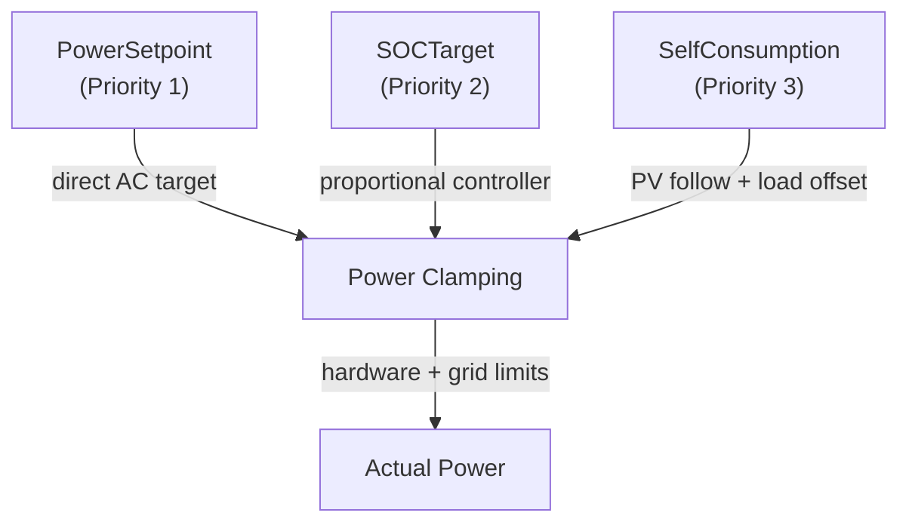
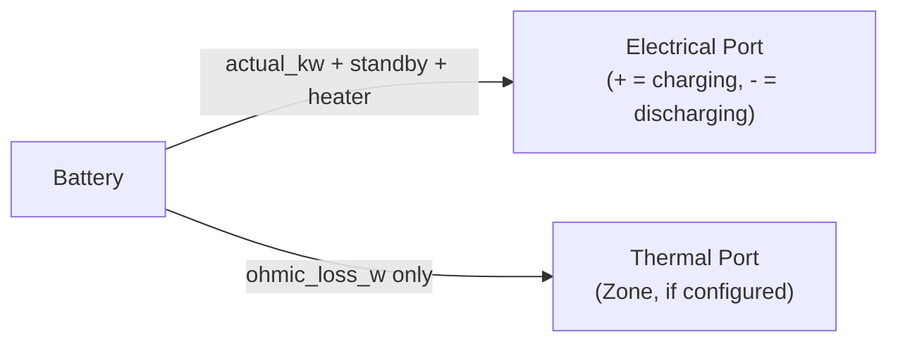

# Battery Equipment Model

[Back to Architecture](../architecture.md)

**Source**: `crates/hares-equipment/src/battery/`

The battery model implements a lithium-ion energy storage system with OCV-based electrical model, lumped thermal dynamics, and a three-mechanism electrochemical degradation model (Smith et al. 2017).

## OCV Model

**Source**: `battery/ocv.rs`

- 11-point Li-NMC OCV lookup table with linear interpolation (NREL SSC / OCHRE calibration)
- Cell voltages from 3.0V (SOC=0) to 4.19V (SOC=1)

### Terminal Voltage

Quadratic formula (OCHRE Battery.py approach):
```
V_terminal = V_oc/2 + sqrt((V_oc/2)^2 + P_dc * R)
```

- Positive DC power = charging, negative = discharging
- When discriminant < 0, power clamped to `P_max = V_oc^2 / (4R)`
- Pack resistance: `R_pack = (R_cell * n_series) / n_parallel` (default R_cell = 0.005 ohm)
- Inverter efficiency: 0.97 default (applied to AC-DC conversion both directions)
- **Reactive control**: supports `ReactiveSetpoint`, `PowerFactorSetpoint`, and `PowerSetpoint.reactive_power_kvar` per [power-factor.md](./power-factor.md). kVA clamp with active-power priority: `|Q| ≤ sqrt(max(0, S² − P²))`. Config fields: `power_factor` (default 1.0), `inverter_capacity_kva` (default `max(max_charge_kw, max_discharge_kw)`)

## SOC Tracking

Direct Coulomb counting:
```
SOC_new = SOC_old + (effective_dc_power_kw * dt_hours) / capacity_kwh
```

- Ohmic losses subtracted from effective power (both charge and discharge directions)
- SOC bounded to [min_soc, max_soc] hardware limits (default 0.15-0.95)
- Self-discharge: optional absolute SOC loss per second (default 0%/day)

## Thermal Model

First-order lumped capacity:
```
dT/dt = (Q_in - Q_loss) / C_thermal
```

Where:
- `Q_in = ohmic_loss_w + heater_power_w`
- `Q_loss = UA * (T_cell - T_ambient)`
- `C_thermal` = 90,000 J/K default, `UA` = 5.0 W/K default

### Temperature Derating

- Below `min_discharge_temp_c` (-20C): discharge blocked
- Below `min_charge_temp_c` (0C): charging blocked (lithium plating hazard)
- Below `full_power_temp_c` (10C): linear power derating
- Cell heater: optional resistive pad (default disabled), activates below threshold

## Degradation Model (Smith et al. 2017)

**Source**: `battery/degradation.rs`

Three-mechanism electrochemical capacity fade model updated daily:

### Mechanism 1: Calendar/SEI Growth (sqrt-of-time)

- Solid-electrolyte-interface layer growth on anode
- Arrhenius temperature dependence: `EA_B1 = 35,392 J/mol`
- Tafel voltage correction at graphite anode potential
- DOD power-law coupling: `exp(gamma * dod_max^beta)`

### Mechanism 2: Cycle-Induced Lithium Loss

- Rainflow cycle counting (ASTM E1049-85 three-point method)
- Daily increment: `dq_li2 = b2_ref * b2_accum * sqrt(sum_squared_dod)`
- Arrhenius dependence: `EA_B2 = -42,800 J/mol` (faster degradation at lower temperatures)

### Mechanism 3: Beginning-of-Life Transient

- Exponential relaxation toward equilibrium: `dq_li3 = (b3_accum - q_li3) / tau_b3`
- `tau_b3 = 5.0 days`

### Capacity Fade

```
capacity_fade = 1.0 - (B0 - q_li1 - q_li2 - q_li3)
```

Where B0 = 1.0 (initial normalized lithium inventory).

## Control Modes



| Signal | Effect |
|--------|--------|
| `PowerSetpoint` | Direct AC power target (kW). Clears SOCTarget and SelfConsumption |
| `SOCTarget` | Proportional controller: `target_kw = error * capacity / dt`. Clears PowerSetpoint |
| `SelfConsumption` | Charge from PV surplus, discharge to offset load. `solar_only_charging` flag prevents grid charging |
| `GridConnect` | Enable/disable grid power flow |

**Capabilities declared**: `POWER_SETPOINT | SOC_TARGET | GRID_CONNECT | SELF_CONSUMPTION | POWER_LIMIT | DEMAND_RESPONSE | REACTIVE_SETPOINT | POWER_FACTOR_SETPOINT`

### Import/Export Limits

- `import_limit_kw`: max charge power from grid (optional)
- `export_limit_kw`: max discharge power to grid (optional)
- Enforced as hard minimum with hardware limits (tightest wins)

## Port Interactions



- **Electrical**: `active_power_kw = actual_power + standby_kw (5W) + heater_kw`. Reactive per [power-factor.md](./power-factor.md): control-precedence then baseline pf, kVA-clamped
- **Deliberate physics — inverter-side vs port-side P**: the baseline reactive power and the kVA clamp use the *inverter-side* `actual_power_kw` (AC charge/discharge power through the inverter), while the electrical-port P additionally includes standby electronics and the cell heater. Standby and heater draws are not inverter throughput, so whenever they are nonzero the *port-level* ratio Q/P deviates slightly from `tan(acos(pf))`. This is intentional, not drift — the inverter holds the displacement power factor only on the power it converts
- **Thermal**: only I^2R ohmic losses to zone (heater energy enters cell thermal mass first, couples via UA; no double-counting)
- **Category**: `ThermalCategory::InternalGain`

## Telemetry

| Field | Unit | Description |
|-------|------|-------------|
| `soc` | 0-1 | State of charge |
| `active_power_kw` | kW | Grid-side power (+ = consuming) |
| `ohmic_loss_w` | W | I^2R dissipation |
| `standby_power_w` | W | BMS/inverter idle draw |
| `cell_temp_c` | C | Cell pack temperature |
| `heater_power_w` | W | Resistive heater power |
| `discharge_derate` | 0-1 | Temperature derating factor |
| `cycle_count` | - | Equivalent full cycles (rainflow) |
| `capacity_fade_pct` | 0-1 | Capacity degradation fraction |
| `reactive_power_kvar` | kvar | Signed bus reactive power (positive = absorbing) |

## Grid Outage Behaviour

The battery is the canonical island source: when the utility voltage is 0.0
and the battery is grid-connected, grid-forming (`grid_forming` config flag,
default true — set false for grid-following-only inverters), and
dischargeable (SOC above its floor, temperature/DR permitting), it holds the
home bus at nominal and serves the loads
(`Equipment::island_source_available`). On a *dead* bus (battery
empty/cold/disconnected) charging, standby electronics, the cell heater, and
vars are all gated.

While **islanded** (utility out, bus energized) charging is clamped to the
visible on-site generation surplus — there is no grid to import from, so an
explicit `PowerSetpoint` charge command beyond the PV/generator surplus is
curtailed to that surplus; self-consumption charging is unaffected (it
already charges only from surplus). Discharge is never clamped by the island
state: downstream (thermal-stage) loads step after the battery, and any
residual island imbalance is reported as `island_unserved_kw` /
`island_excess_kw` in `DwellingTelemetry`. See
[outage-behavior.md](../outage-behavior.md).
