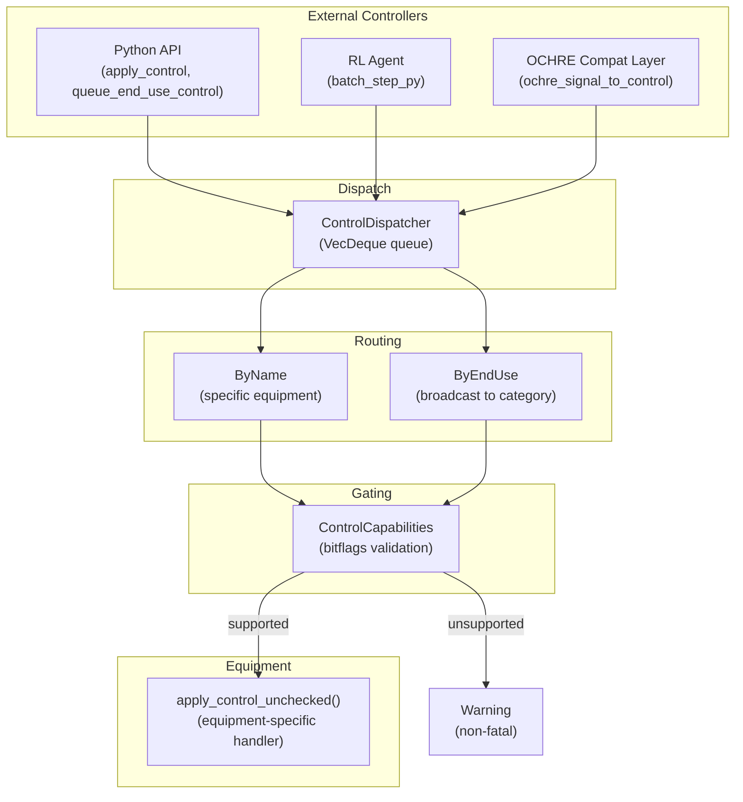

# Control System & Demand Response

[Back to Architecture](../architecture.md)

**Source**: `crates/hares-control/src/`, `crates/hares-types/src/control_signal.rs`

## Control Architecture



### Dispatch Queue

- `ControlDispatcher` uses `VecDeque<DispatchRequest>` drained each timestep
- Dispatch occurs after environment update, before equipment execution
- `apply_control()` returns `Err` for unsupported signals; the dwelling layer catches these and logs non-fatal warnings (simulation continues)

### Routing Modes

- **ByName**: targets a specific equipment instance (e.g., `"Garage Battery"`)
- **ByEndUse**: broadcasts to ALL equipment with matching `EndUse` (e.g., all batteries)

### Dwelling API

```rust
dwelling.apply_control(name, signal)              // queue by instance name
dwelling.queue_end_use_control(end_use, signal)   // queue by category
dwelling.queue_dispatch(request)                   // queue raw DispatchRequest
dwelling.set_price_signal(signal)                  // stored for controller access
```

## Capability Gating

16 capabilities as `u32` bitflags:

| Capability | Signal |
|-----------|--------|
| `POWER_SETPOINT` | `PowerSetpoint` |
| `SOC_TARGET` | `SOCTarget` |
| `THERMAL_SETPOINT` | `ThermalSetpoint` |
| `HUMIDITY_SETPOINT` | `HumiditySetpoint` |
| `POWER_LIMIT` | `PowerLimit` |
| `MODE_OVERRIDE` | `ModeOverride` |
| `DUTY_CYCLE` | `DutyCycle` |
| `LOAD_FRACTION` | `LoadFraction` |
| `GRID_CONNECT` | `GridConnect` |
| `SELF_CONSUMPTION` | `SelfConsumption` |
| `DEMAND_RESPONSE` | `DemandResponse` |
| `CURTAILMENT_PERCENT` | `CurtailmentPercent` |
| `REACTIVE_SETPOINT` | `ReactiveSetpoint` |
| `POWER_FACTOR_SETPOINT` | `PowerFactorSetpoint` |
| `INVERTER_PRIORITY_MODE` | `InverterPriorityMode` |
| `PROTOCOL_NATIVE` | `ProtocolNative` |

Equipment declares capabilities at initialization. `apply_control()` validates the signal's required capability before dispatching to `apply_control_unchecked()`. Rejection is binary: supported (continues) or unsupported (returns Err).

### Reactive Control Signals

Three signals control reactive power on capable equipment (PV, battery, and EV; see [power-factor.md](power-factor.md) for the full model):

| Signal | Semantics | Accepts On |
|--------|-----------|------------|
| `ReactiveSetpoint { kvar }` | Direct var setpoint. Positive = absorbing (inductive), negative = supplying (capacitive). Passed through as-commanded with no sign flip. | PV, Battery, EV |
| `PowerFactorSetpoint { power_factor }` | Sets displacement power factor in (0, 1]. Clears the `q_setpoint_kvar` override (to `None`) so future steps use the updated pf for baseline reactive computation. | PV, Battery, EV |
| `PowerSetpoint.reactive_power_kvar: Some(q)` | Var command embedded in the power setpoint; any `Some(q)` — including `Some(0.0)` — arms the same absolute override as `ReactiveSetpoint` (a commanded zero forces Q = 0 over a pf < 1 baseline). `None` leaves the reactive state untouched. | PV, Battery, EV |

**EV accepts all three reactive control paths** with the same smart-inverter var-control semantics as the battery: q_setpoint > PowerFactorSetpoint > baseline precedence, kVA clamp with active-power priority, signed Q on port/CoreOutput/telemetry. The EV is an inverter-coupled DER (V2G/V2L) where IEEE 1547-2018 / SAE J3072 require reactive capability. Default `power_factor=1.0` (PFC unity baseline) produces Q=0, preserving bit-identical real power for pre-reactive simulations. See [ev.md](ev.md) for config fields and [power-factor.md](power-factor.md) for the full reactive model.

## OpenADR 3.0 Compatibility

### DRLevel Enum

```rust
pub enum DRLevel {
    Normal,          // No DR active
    Moderate,        // ~30% reduction
    High,            // ~60% reduction
    Critical,        // ~80% reduction
    GridEmergency,   // ~100% shed
}
```

### OpenADR Signal Mapping

| OpenADR Signal | HARES ControlSignal | Notes |
|---|---|---|
| SIMPLE (0-3) | `DemandResponse { level }` | Direct 1:1 mapping |
| LOAD_DISPATCH (kW) | `PowerSetpoint` / `PowerLimit` | Requires disaggregation |
| CHARGE_STATE_SETPOINT | `SOCTarget` | Battery/EV only |
| GRID_EMERGENCY | `DemandResponse::GridEmergency` | Full shed |
| ELECTRICITY_PRICE | `PriceSignal` (separate type) | Feeds controller, not equipment |
| EXPORT_PRICE | `PriceSignal` | Feeds controller, not equipment |
| GHG (carbon intensity) | `PriceSignal` | Feeds controller, not equipment |

### Equipment DR Responses

Each equipment type implements DR behavior independently:

**Water Heater example**:
| Level | Setpoint Offset | Load Fraction | Backup |
|-------|----------------|---------------|--------|
| Normal | 0C | 1.0 | Yes |
| Moderate | -3C | 1.0 | Yes |
| High | -6C | 0.75 | Yes |
| Critical | -10C | 0.5 | Yes |
| GridEmergency | -15C | 0.25 | Locked out |

**Duration auto-revert**: timer decrements each step, reverts to Normal on expiration. `duration_s = None` means indefinite.

### Control State Separation

DR state and transient control state are tracked independently:
```
dr_load_fraction     <- persistent DR state (from DemandResponse signal)
ctrl_load_fraction   <- transient signal (from LoadFraction, resets each step)
effective_fraction   = dr_load_fraction * ctrl_load_fraction
```

This allows overlapping control authorities without state corruption.

## Price Signals

Price signals are **separate** from `ControlSignal` -- they feed a Python controller that produces control signals:

```rust
pub struct PriceSignal {
    pub electricity_price: Option<f64>,   // $/kWh
    pub export_price: Option<f64>,        // $/kWh for export
    pub ghg_intensity: Option<f64>,       // kg CO2e/kWh
}
```

Architecture: `PriceSignal -> Python controller -> ControlSignal -> Equipment`

## OCHRE Compatibility Layer

**Source**: `crates/hares-control/src/compat.rs`

Translates OCHRE-style `HashMap<String, f64>` signals to typed `ControlSignal`:

| OCHRE Key | ControlSignal |
|---|---|
| `"Setpoint Temperature (C)"` | `ThermalSetpoint` |
| `"P Setpoint"` | `PowerSetpoint` |
| `"Duty Cycle"` | `DutyCycle` |
| `"Load Fraction"` | `LoadFraction` |
| `"SOC"`, `"Min SOC"`, `"Max SOC"` | Grouped `SOCTarget` |
| `"Self Consumption Mode"` | `SelfConsumption` |

SOC grouping: all three present -> `(target, min, max)`; only min+max -> `target=min`; only SOC -> `target=min=max`.

## Default Control Behavior

When no external signals are sent:
- **HVAC**: thermostat FSM evaluates zone_temp vs setpoint +/- deadband from config/schedule
- **Battery**: idles (no charge/discharge), respects hardware min/max SOC. At idle with `power_factor=1.0` (default), produces zero reactive power. Accepts `ReactiveSetpoint`, `PowerFactorSetpoint`, and `PowerSetpoint.reactive_power_kvar` for var control even while idle
- **Water Heater**: internal thermostat with configured deadband
- **PV**: generates at full capacity with configured inverter settings
- **EV**: charges per availability schedule and archetype
- **DR auto-revert**: existing DR timer decrements each step, reverts to Normal on expiration

## Python API

```python
from hares import ControlSignal, EndUse

# Factory methods
signal = ControlSignal.power_setpoint(kw=5.0, reactive_kvar=None)
signal = ControlSignal.thermal_setpoint(heat_c=20.0, cool_c=25.0)
signal = ControlSignal.demand_response(level="High", duration_s=3600.0)

# From dict (all 16 variants)
signal = ControlSignal.from_dict({
    "type": "DemandResponse",
    "level": "Critical",
    "duration_s": 1800.0
})

# Dispatch
dwelling.apply_control("Battery #1", signal)
dwelling.queue_end_use_control(EndUse.HvacHeating, signal)
```
