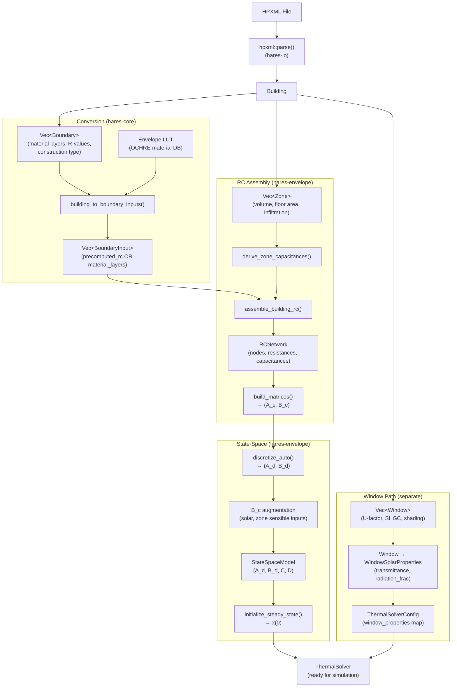
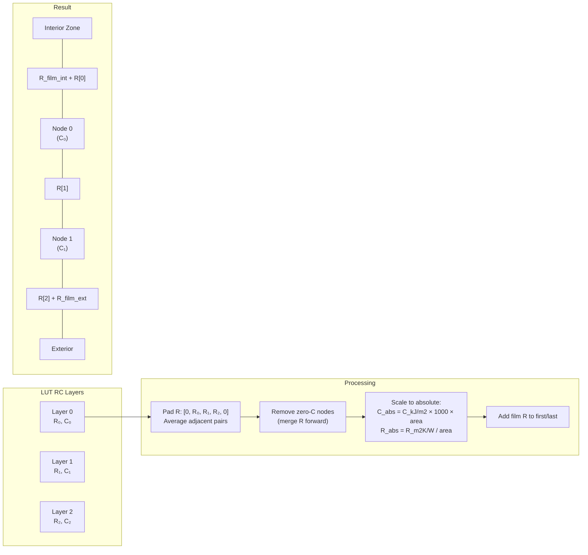
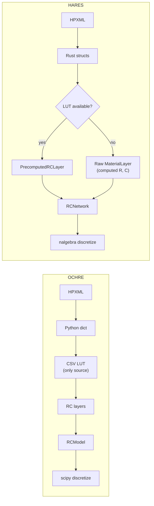

# Building Envelope Construction Pipeline

[Back to Architecture](../architecture.md)

This document traces the complete path from HPXML input to a discretized state-space thermal model, covering material/R-value identification, RC network node construction, matrix assembly, and steady-state initialization. It also compares the approach to OCHRE's reference implementation.

## End-to-End Pipeline



---

## 1. HPXML Parsing: Boundary & Material Identification

**Source**: `crates/hares-io/src/hpxml/building.rs`

### Boundary Struct

Each HPXML boundary element is parsed into:

```rust
pub struct Boundary {
    pub id: String,
    pub boundary_type: BoundaryType,           // Wall, Roof, Floor, Door, FoundationWall, RimJoist, Slab, Window
    pub area_m2: f64,
    pub azimuth_deg: Option<f64>,
    pub assembly_r_value_m2_k_w: Option<f64>,  // Total assembly R-value (m2*K/W)
    pub r_value_layers_m2_k_w: Vec<f64>,       // Per-layer nominal R-values
    pub interior_zone: Option<ZoneType>,
    pub exterior_zone: Option<ZoneType>,
    pub material_layers: Vec<MaterialLayer>,
    pub construction_type: Option<String>,      // "WoodStud", "ConcreteMasonryUnit", etc.
    pub finish_type: Option<String>,            // "vinyl siding", "asphalt shingles", etc.
    pub insulation_details: Option<String>,     // "R-13", "Uninsulated" (for LUT matching)
    pub has_radiant_barrier: bool,
    pub solar_absorptance: Option<f64>,
    pub emittance: Option<f64>,
    pub tilt_deg: Option<f64>,
}
```

### Material Layer Struct

Individual material layers carry full thermophysical properties:

```rust
pub struct MaterialLayer {
    pub thickness_m: f64,
    pub conductivity_w_m_k: f64,
    pub density_kg_m3: f64,
    pub specific_heat_j_kg_k: f64,
    pub area_m2: f64,
}
```

### R-Value Resolution (Three Sources)

R-values are resolved in priority order during parsing:

| Priority | Source | HPXML Element | Notes |
|----------|--------|---------------|-------|
| 1 | Assembly R-value | `<AssemblyEffectiveRValue>` | Total including framing, insulation, air films |
| 2 | Per-layer nominal R | `<Layer><NominalRValue>` | Summed for total; individual values retained |
| 3 | Derived from conductivity | `thickness / conductivity` | When conductivity is available but R-value is not |

### Material Layer Conductivity Derivation

```rust
let conductivity = match (conductivity_w_m_k, thickness_m, nominal_r) {
    (Some(k), _, _) => Some(k),                          // Direct conductivity preferred
    (None, Some(t), Some(r)) if r > 0.0 => Some(t / r),  // Derive from nominal R
    _ => None,                                             // Skip layer
};
```

Only layers with valid thickness AND conductivity are retained.

### Construction Metadata for LUT Matching

The parser extracts metadata used to match boundaries against the OCHRE material database:
- **Walls**: `WallType` child tag name -> `construction_type` (e.g., "WoodStud")
- **Roofs**: pitch -> "Pitched" vs "Flat"; `RoofType` -> `finish_type`
- **Floors**: `FloorType` child tag name
- **Tilt angle**: computed from roof pitch: `tilt = atan(pitch/12).to_degrees()`

---

## 2. Envelope LUT: OCHRE Material Database Lookup

**Source**: `crates/hares-io/src/envelope_lut.rs`

The envelope LUT maps HPXML boundary descriptions to pre-computed RC parameters from OCHRE's material database, loaded from CSV files in the `defaults/envelope/` directory.

### LUT Data Structure

```rust
pub struct PrecomputedRCLayer {
    pub resistance_m2_k_w: f64,      // Specific resistance [m2*K/W]
    pub capacitance_kj_m2_k: f64,    // Specific capacitance [kJ/(m2*K)]
}
```

### Boundary Name Resolution

HPXML zone-pair adjacency maps to OCHRE boundary names:

| Interior Zone | Exterior Zone | Boundary Type | OCHRE Name |
|---------------|---------------|---------------|------------|
| Conditioned | Outdoor | Wall | "Exterior Wall" |
| Conditioned | Attic | Floor | "Attic Floor" |
| Conditioned | Foundation | Floor | "Foundation Ceiling" |
| Garage | Conditioned | Wall | "Garage Attached Wall" |
| Attic | Outdoor | Roof | "Attic Roof" |
| Foundation | Ground | Wall | "Foundation Wall" |

### Lookup Algorithm

1. **Progressive filtering** by construction_type, finish_type, insulation_details
2. **R-value matching** when multiple candidates remain:
   - Adjusts assembly R-value by adding film resistance (boundary-type dependent)
   - Floor/ceiling: `FILM_R = 0.2642 m2*K/W`
   - Wall/roof: `FILM_R = 0.1585 m2*K/W`
   - Selects closest R-value match (clamped to ~88 m2*K/W for "Minimal" boundaries)
3. **Returns** ordered list of `PrecomputedRCLayer` for the matched assembly

### Fallback Behavior

If LUT loading fails (CSV files missing), system logs a warning and falls back entirely to raw material layer computation. This is non-fatal.

---

## 3. Boundary-to-BoundaryInput Conversion

**Source**: `crates/hares-core/src/dwelling/conversions.rs`

```rust
pub struct BoundaryInput {
    pub area_m2: f64,
    pub interior_zone_idx: usize,
    pub exterior: ExteriorTarget,              // Outdoor, Ground, or Zone(idx)
    pub material_layers: Vec<LayerInput>,       // Raw material properties
    pub precomputed_rc: Vec<PrecomputedRCLayer>, // OCHRE LUT results (takes priority)
    pub fallback_r_m2_k_w: f64,                // Assembly R-value fallback
    pub r_film_interior_m2_k_w: f64,
    pub r_film_exterior_m2_k_w: f64,
}
```

**Priority logic**:
1. Attempt LUT lookup using boundary name + construction metadata + assembly R-value
2. If LUT returns results: populate `precomputed_rc`, raw `material_layers` ignored during RC construction
3. If LUT fails: use raw `material_layers` from HPXML
4. If no material layers: use `fallback_r_m2_k_w` (assembly R or default 2.5 m2*K/W)

---

## 4. RC Network Node Identification

**Source**: `crates/hares-envelope/src/boundary_rc.rs`

### NodeId Scheme

```
NodeId(1) .. NodeId(n_zones)     → Zone air nodes (conditioned, attic, garage, etc.)
NodeId(1000) .. NodeId(1000+N)   → Material layer capacitance nodes (allocated sequentially)
NodeId(u32::MAX - 1)             → OUTDOOR_NODE (external driving input)
NodeId(u32::MAX)                 → GROUND_NODE (external driving input)
```

### Zone Air Node Capacitance

```
C_zone = rho_air * Cp_air * Volume * INTERIOR_MASS_MULTIPLIER
       = 1.2 * 1006 * V * 7.0  [J/K]
```

| Constant | Value | Purpose |
|----------|-------|---------|
| `AIR_DENSITY_KG_M3` | 1.2 | Standard air density |
| `AIR_CP_J_KG_K` | 1006 | Air specific heat |
| `INTERIOR_MASS_MULTIPLIER` | 7.0 | Accounts for furnishings, structure, contents |
| `MIN_CAPACITANCE_J_K` | 1000 | Floor to prevent near-singularity |
| `DEFAULT_VOLUME_M3` | 200 | Fallback if zone volume unavailable |
| `DEFAULT_HEIGHT_M` | 2.5 | Derives volume from floor area |

Volume resolution: direct `volume_m3` > `floor_area_m2 * DEFAULT_HEIGHT_M` > `DEFAULT_VOLUME_M3`

### Film Resistances

| Film | Value (m2*K/W) | Scaled |
|------|---------------|--------|
| `R_FILM_EXTERIOR` | 0.03 | `R / area` [K/W] |
| `R_FILM_INTERIOR` | 0.12 | `R / area` [K/W] |

Added to the first (interior) and last (exterior) resistors of each boundary's RC chain.

---

## 5. RC Network Construction: Two Paths

### Path A: Precomputed RC Layers (OCHRE LUT)

**Function**: `build_precomputed_boundary()`



Algorithm steps:
1. **Same-zone handling**: if interior wall, cut node count in half (both sides see same effect)
2. **Resistance splitting**: pad R list with zeros, average adjacent pairs -> N+1 resistors
3. **Zero-capacitance removal**: nodes with C=0 have their resistance merged into the next node
4. **Remove last resistor for same-zone**: if interior wall, pop the trailing resistor (no exterior connection)
5. **Scale to absolute**: `C_abs = C_specific * 1000 * area` (kJ->J), `R_abs = R_specific / area`
6. **Add film resistances** to first and last resistors
7. **Wire as series chain**: interior_zone -> R[0] -> C[0] -> R[1] -> ... -> R[n] -> exterior

### Path B: Raw Material Layers

**Function**: `build_layered_boundary()`

For each material layer:
- **Capacitance**: `C = density * Cp * thickness * area` [J/K], clamped to MIN_CAPACITANCE_J_K
- **Inter-layer resistance**: `R = thickness_i/(2*k_i*area) + thickness_j/(2*k_j*area)` (half-thickness from each side)
- **Interior film**: `R = R_film_interior/area + thickness_0/(2*k_0*area)`
- **Exterior film**: `R = thickness_n/(2*k_n*area) + R_film_exterior/area`

### Same-Zone (Interior Wall) Handling

Interior walls (same zone on both sides) represent internal thermal mass:
- Truncate to inner half of layers only
- Odd layer count: halve the middle layer's capacitance
- No exterior resistance connection (creates a dead-end thermal mass "fin")
- Heat conducts in from the zone, stores in mass, conducts back out

---

## 6. Windows: Separate Path

**Source**: `crates/hares-core/src/dwelling/solver_builder.rs`

Windows do NOT enter the RC network. They are handled as pure resistive links with specialized solar properties:

```rust
let u_factor = win.u_factor_w_m2_k.unwrap_or(5.0);
let effective_shgc = win.shgc.unwrap_or(0.4) * win.interior_shading_fraction;

// Glass resistance from U-factor (subtract film resistances)
let r_total = 1.0 / u_factor.max(0.01);
let r_glass = (r_total - r_film_interior - r_film_exterior).max(0.0);
```

Window solar properties stored in `ThermalSolverConfig`:
- `shgc`: effective SHGC after interior shading
- `transmittance`: fraction of solar transmitted through glazing
- `radiation_frac`: fraction of absorbed solar reaching interior
- Solar gain routing uses EnergyPlus IAM (incident angle modifier) correction per glazing

---

## 7. RC Network -> State-Space Matrices

**Source**: `crates/hares-envelope/src/rc_network.rs`

### Matrix Assembly (Nodal Analysis)

For each internal node `i` with capacitance `C_i` and resistance `R_ij` to neighbor `j`:

```
If j is internal:  A_c[i,j] = +1/(R_ij * C_i)     (off-diagonal)
                    A_c[i,i] -= 1/(R_ij * C_i)      (diagonal: sum of all connections)

If j is external:  B_c[i,k] = +1/(R_ij * C_i)      (driving input column k)
```

Internal nodes are sorted by NodeId for deterministic matrix ordering.

### Floating Node Elimination

Nodes with zero capacitance (pure resistive junctions) are eliminated to reduce state dimension. Resistances between remaining neighbors are computed via conductance combination:

```
G_new(a,b) = G(a,floating) * G(b,floating) / sum(all G from floating)
```

### B_c Augmentation

The raw B_c from RC assembly is augmented with additional input columns for the thermal solver:

```
Column layout:
[0..n_ext)                            → External driving (outdoor temp, ground temp)
[n_ext..n_ext+n_ext_surface_inputs)   → Per-exterior-surface solar/LWR injection (gain = 1/C_outer_node)
[n_ext+n_ext_surface_inputs..n_total) → Zone sensible heat inputs (gain = 1/C_zone)
```

Note: `n_ext_surface_inputs` is the count of exterior-facing boundaries that have RC layer nodes (an outer material node to inject into). Boundaries that fell through to the pure-resistor fallback (no material layers, no precomputed RC) do NOT get a dedicated injection column; their solar gains are routed through the zone sensible heat column instead.

### Output Mapping (C Matrix)

Zone temperatures extracted via identity mapping:

```
C[zone_idx, zone_state_row] = 1.0
D = 0  (no direct feed-through)
y = C * x  → zone temperatures
```

---

## 8. Discretization

**Source**: `crates/hares-envelope/src/state_space.rs`

### Primary: Zero-Order Hold (ZOH)

```
A_d = exp(A_c * dt)
B_d = A_c^(-1) * (A_d - I) * B_c
```

Matrix exponential via 13th-order Pade scaling-and-squaring. `A_c` inversion via LU factorization with reciprocal condition number check (threshold 1e-12).

### Fallback: Van Loan Method

For singular `A_c` (e.g., disconnected subnetworks):

```
Augmented = [A_c  B_c]  * dt
            [0    0  ]

exp(Augmented) → extract top-right block for B_d
```

Avoids explicit `A_c^(-1)`.

### Eigenvalue Stability

For networks with n <= 20 states:
- Continuous: all Re(lambda) < 0
- Discrete: all |lambda| < 1
- Near-unity detection: |lambda_d| > 0.99 triggers convergence warning

---

## 9. Steady-State Initialization

**Source**: `crates/hares-envelope/src/thermal_solver/mod.rs`

The initial state `x(0)` is computed so that all material nodes have physically realistic temperature gradients through walls at equilibrium:

### Algorithm

1. **Build initial input vector `u`**:
   - Outdoor temperature at `outdoor_temp_input_indices`
   - Indoor temperature at `indoor_temp_input_indices` (separate from zone sensible heat indices)
   - All other inputs (solar, zone sensible, HVAC) set to zero

2. **Identify zone states to fix as boundary conditions**:
   - Zone air temperatures forced to `indoor_temp_c`
   - These become constraints, not unknowns

3. **Accumulate coupling from fixed zones into RHS** (two-pass approach):
   ```
   b_rhs = B_d * u
   for each fixed zone j at temperature T_j:
       b_rhs += A_d[:, j] * T_j     // accumulate full column (including zone rows)
   ```

4. **Remove zone rows/columns**:
   ```
   A_d_reduced = A_d with zone rows and columns removed
   b_rhs_reduced = b_rhs with zone rows removed
   ```
   Note: coupling is accumulated before row removal, so zone-to-zone coupling terms are computed then discarded (mathematically equivalent to clean partitioning).

5. **Solve reduced steady-state**:
   ```
   (I - A_d_reduced) * x_reduced = b_rhs_reduced
   x_reduced = (I - A_d_reduced)^(-1) * b_rhs_reduced
   ```

6. **Restore full state vector**: re-insert zone temperatures at their constraint values

**Fallback**: if matrix inversion fails, all states set to `indoor_temp_c`.

**Physical meaning**: a wall between 20C indoor and -5C outdoor will have its layers initialized at intermediate temperatures (e.g., 18C, 12C, 5C, -1C from inside to outside), not all at 20C or all at -5C.

---

## 10. Comparison with OCHRE

### Pipeline Comparison

| Stage | OCHRE | HARES |
|-------|-------|-------|
| **HPXML parsing** | Python dict-based, fail-fast | Rust structured types, collected errors |
| **Material source** | Always pre-computed from CSV LUT | Pre-computed LUT (preferred) OR raw material layers (fallback) |
| **Boundary name resolution** | Zone-pair adjacency -> OCHRE name | Same mapping logic |
| **RC assembly** | `create_rc_data()`: pad, average, remove zero-C, scale | `build_precomputed_boundary()`: identical algorithm |
| **Floating node reduction** | Star-mesh transform in `RCModel.py` | Same in `rc_network.rs` |
| **Matrix assembly** | Conductance matrix from node graph | Same nodal analysis approach |
| **Discretization** | `scipy.signal.cont2discrete` (ZOH + Van Loan) | `discretize_auto()` (same two methods) |
| **Steady-state init** | `np.linalg.inv(A)` with zone constraints | `nalgebra` LU solve with zone constraints |

### Node Naming

| | OCHRE | HARES |
|-|-------|-------|
| Zone air | `Zone_LIV`, `Zone_ATT`, etc. | `NodeId(1)`, `NodeId(2)`, etc. |
| Material layers | `BW1_Layer0`, `BW1_Layer1` | `NodeId(1000)`, `NodeId(1001)`, etc. |
| External | `EXT`, `GND` | `NodeId(u32::MAX-1)`, `NodeId(u32::MAX)` |

### Key Architectural Differences



**HARES advantage**: dual-path (LUT + raw computation) means it can model novel assemblies not in the OCHRE database, while maintaining OCHRE parity for standard constructions.

**OCHRE advantage**: the material database is comprehensive and EnergyPlus-validated. HARES's raw computation path produces equivalent results for simple assemblies but may diverge for complex constructions with air gaps, framing factors, or non-uniform layers.

### Steady-State Initialization (Identical Approach)

Both systems:
1. Set zone air temperatures to initial setpoint
2. Remove zone states from the system (treat as boundary conditions)
3. Solve `(I - A_d) * x = B_d * u` for remaining material node temperatures
4. Re-insert zone temperatures into the full state vector

This ensures walls start with physically realistic temperature gradients rather than uniform indoor or outdoor temperature.
