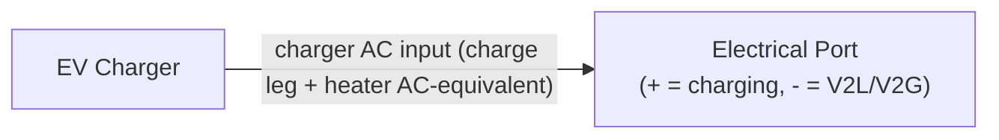

# EV Charger Equipment Model

[Back to Architecture](../architecture.md)

**Source**: `crates/hares-equipment/src/ev/`

The EV charger models Level 1 and Level 2 residential charging with stochastic driving patterns, SOC-dependent charging curves, temperature derating, and vehicle-to-load (V2L) support.

## Charging Model

### Charging Levels

| Level | Power Range | Default |
|-------|-------------|---------|
| L1 | 1.0-1.8 kW | 1.4 kW (12A x 120V) |
| L2 | 3.6-11.5 kW | Capacity-tiered: 1-2 (3.6), 3 (7.2), 4+ (11.5) |

### Power Tapering

- **PyBaMM LUT**: optional 4D curve (soc, temp, c_rate, soh → power_fraction). A configured LUT's temperature axis **is** the temperature-dependent capability — a measured curve already contains the manufacturer's low-temperature derate — so the linear BMS ramp below is *not* multiplied on top of it (one physical effect, applied once)
- **LUT c-rate divisor**: the charge power over the degradation-adjusted rating (`rated × SOH`) — the shared `pack_electrical` rule, the same convention the stationary Battery's `capacity_kwh_nominal` follows (OCHRE `Battery.py`, degradation-adjusted nominal). Temperature enters the lookup only through the LUT's own axes, never through the divisor — a temperature-derated divisor would apply the reversible derate twice (≈1.3× c-rate inflation at 0 °C)
- **Temperature derating** (no LUT): linear ramp from 0% (below `min_charge_temp_c` = 0 °C, the Li-plating cutoff — Battery University BU-410) to 100% (above `full_power_temp_c` = 10 °C)
- **Plating cutoff**: charge power is zero at/below `min_charge_temp_c` unconditionally — including with a LUT, whose measurement regime normally starts above the cutoff; a curve cannot grant permission the BMS physics denies
- **Taper limit**: prevents SOC overshoot: `taper_kw = (soc_limit - soc) * capacity / dt / efficiency` on the charge leg
- **Supply cap & priority**: the charger's AC input (charge leg + heater AC-equivalent) is bounded by `min(rating, power_limit)`; below the plating cutoff the heater takes the bound, above it charging draws first and the heater takes the remainder
- **DR**: the demand-response fraction is a multiplier on the allocated total (a commanded zero zeroes the port)

### Pack Thermal Model

Aligned with the stationary Battery's architecture (one shared pack-electrical home for the terminal-voltage solve and I²R):

- **Thermal mass**: capacity-derived — `capacity_kwh × 6.4 kg/kWh × 1000 J/(kg·K)` ≈ 480 kJ/K for 75 kWh (Tesla Model 3 LR pack mass; Li-ion cell specific heat at the 800–1100 J/(kg·K) calorimetry band's midpoint) → day-scale relaxation (τ = C/UA ≈ 8.5 h)
- **UA**: area-scaled from the Battery's enclosed-pack 5 W/K (`5.0 × (capacity/13.5)^(2/3)`; 15.7 W/K at 75 kWh)
- **Pack heating**: I²R through the cell resistance only (96S topology, 5 mΩ cells default, `n_series`/`n_parallel`/`cell_resistance_ohm` configurable). The AC→DC conversion loss dissipates in the charger, never the cells
- **Initialization**: explicit `battery_temp_c` config, else outdoor ambient (the Battery's cascade; the EV has no zone)
- **Preconditioning**: a 5 kW pack-preheating heater (Webasto HVH entry class) activates on pack temperature ≤ `heater_threshold_c` (5 °C default) whenever connected with an energized supply — charging, idle, or discharging. The heater is a pack-side DC load covered by the charger's raised import while plugged in (the pack nets zero in the heater-only state); during V2L/V2G it draws from the pack and stops at the discharge floor
- **Drive I²R**: drive energy heats the pack at its equivalent discharge current through the same solve
- **Degradation guard**: the Smith 2017 fit errors loudly on cell temperatures outside the physical envelope [−100, +130] °C; sub-zero operation above that is deliberate, documented extrapolation (the fit's validated domain is 0–55 °C, NREL/CP-5400-67102 Table I)

## Vehicle Archetype

- Capacity: direct config, or `range_miles * 0.325 kWh/mi`, or default 75 kWh
- Charging efficiency: 0.9 default (AC-to-DC)
- SOC limits: `initial_soc` (default 1.0), `soc_max` (default 1.0)

### Driver Archetypes (12 variants)

Stochastic daily driving with log-normal mileage distribution calibrated to
NHTS 2017 VMT data (μ ≈ 3.35, σ ≈ 0.65 for typical ~35 mi/day, CV ≈ 0.73).
Log-normal has natural [0,∞) support, correctly capturing the right-skew
observed in daily VMT without the negative-draw clamping artefact of a
Gaussian parameterisation.

| Archetype | Level | Departure | Duration | Daily mi (mean) | Strategy |
|-----------|-------|-----------|----------|-----------------|----------|
| Daily Commuter L2 | L2 | 08:00 | 10h | 38 | Nightly (22-6, 90% SOC) |
| Daily Commuter L1 | L1 | 08:00 | 10h | 25 | Immediate (100%) |
| Long Commuter L2 | L2 | 07:00 | 11h | 75 | Immediate (100%) |
| WFH Occasional | L2 | 10:00 | 3h | 12/25 wd/we | Low SOC (30%/80%) |
| WFH L1 Minimal | L1 | 10:00 | 2h | 8 | Immediate (100%) |
| Heavy-Use SUV | L2 | 08:00 | 10h | 55 | Nightly (22-6, 90% SOC) |
| Shift Worker | L2 | 06:00 | 9h | 30 | PreDeparture (90%) |
| Weekend Warrior | L2 | 09:00 | 8h | 10/30 wd/we | Low SOC (30%/80%) |
| Workplace Charger | L1 | 08:00 | 10h | 30 | Immediate (100%) |
| Retiree L1 | L1 | 10:00 | 3h | 10 | Immediate (100%) |
| PHEV Commuter | L2 | 08:00 | 10h | 35 | Nightly (22-6, 90% SOC) |
| TOU Optimizer CA | L2 | 08:00 | 10h | 38 | TOU Aware (90%) |

## Availability & Plug-In Policy

- Event-based: daily (arrival_minute, duration_minutes, start_soc, weight) sampling
- **Always** policy (default): plugs in whenever in window
- **LowSoc** policy: only plugs in if SOC < threshold (default 0.3)
- Arrival/departure times jittered by configurable fuzz minutes

## Charging Strategy Constraints

Applied in priority order:
1. **Immediate Charge Hold**: if `immediate_target_soc` set and SOC >= threshold, charge blocked until `delay_until_hour`
2. **TOU Peak Avoidance**: charging blocked during peak window `[start_hour, end_hour)` (wrap-around supported)
3. **Ready-By Mandate**: calculates required power to hit `ready_target_soc` by `ready_by_hour`

## V2L / V2G Discharge

- Enabled via `v2l_enabled` / `v2g_enabled` (default false)
- Negative `PowerSetpoint` triggers discharge (V2G takes precedence when both are enabled)
- Constraints: SOC > the effective floor `max(reserve, commanded min_soc, ready_by_soc)` — `v2l_soc_reserve` 0.2 / `v2g_soc_reserve` 0.3; max `v2l_max_discharge_kw` 3.0 kW / `v2g_max_discharge_kw` 5.0 kW
- The discharge budget covers the **total pack-side draw** — the export converted at `charging_efficiency` plus the heater's DC draw — so the pack never lands below the floor; at the floor both the export and the heater stop

## Control Signals

| Signal | Effect |
|--------|--------|
| `PowerSetpoint` | Direct charge/discharge target (negative = V2L) |
| `PowerLimit` | Maximum charging power cap |
| `SOCTarget` | Primary SOC goal with optional min/max bounds |

## Port Interactions

- **Electrical only**: the port carries the charger's AC input alone in every state — import when charging or covering the pack heater, export when discharging (the heater is a pack-side DC load, not an AC-side load; away charging contributes nothing to the residential port)
- No thermal or fuel ports (the pack sits outdoors/garage; its heat is not a zone gain — a documented divergence from the zoned stationary Battery)
- **Operating mode** keys on the pack-side net rate and the export leg, never the port total: `Charging` when the pack nets positive; `Discharging` when the export leg is nonzero (a grid-facing discharge — a negative net from the heater alone is internal preconditioning, not an export); `Heating` for the charger-fed preconditioning state (charge leg zero, heater drawing, the port billing the heater's AC-equivalent); `Standby` for the pack-fed preconditioning state (a commanded V2L/V2G export curtailed to zero — e.g. a GridEmergency DR event — while the heater draws from the pack: energized, zero port, the same label the stationary Battery reports for a commanded-zero discharge); `On` for standby var support, `Off` for all-zero flows

### Smart-Inverter Var Control

The EV is an inverter-coupled DER (V2G/V2L via DC-link inverter) and IEEE 1547-2018 / SAE J3072 require reactive capability. The EV supports the same smart-inverter var control as the battery:

| Signal | Behaviour |
|--------|-----------|
| `PowerSetpoint.reactive_power_kvar: Some(q)` | Sets absolute var override (finite values accepted) |
| `ReactiveSetpoint { kvar }` | Direct var setpoint, positive = absorbing |
| `PowerFactorSetpoint { power_factor }` | Sets displacement power factor in `(0, 1]`, clears the `q_setpoint_kvar` override (`None`) |

**Config fields**:
| Field | Default | Meaning |
|-------|---------|---------|
| `power_factor` | `1.0` | Displacement power factor; 1.0 = unity (PFC rectifier baseline, bit-identical to legacy behaviour) |
| `charger_capacity_kva` | `max(max_charging_power_kw, v2g_max_discharge_kw, v2l_max_discharge_kw)` | Apparent-power rating for kVA clamp |

**Precedence** (same as battery):
1. `q_setpoint_kvar` (from `ReactiveSetpoint` or `PowerSetpoint.reactive_power_kvar`) — absolute override, passed through as-commanded
2. `power_factor` baseline: `Q = P · tan(acos(pf))` — sign follows var flow (charging P>0 → Q>0 absorbing; V2G/V2L discharge P<0 → Q<0 supplying)

Both uses key on the **inverter leg** — the charge/discharge conversion power — never the heater-inclusive port total: a PTC pack heater is resistive and DC-fed, not inverter-coupled, so it produces no vars and consumes no inverter kVA headroom (the same inverter-leg keying the stationary Battery uses).

**kVA clamp**: `|Q| ≤ sqrt(max(0, S² − P²))` with `S = charger_capacity_kva` — active-power priority (P never curtailed for Q).

**Sign convention**: positive = inductive/absorbing vars, negative = capacitive/supplying vars. The same signed value is written to port, CoreOutput, and telemetry (`REACTIVE_POWER_KVAR` key) with no negation.

**Checkpoint**: `q_setpoint_kvar` (`Option<f64>` — `None` = no override, `Some(0.0)` = commanded zero) and `power_factor` are persisted in the EV checkpoint (version 3), so reactive state survives save/load. On load, `reactive_power_kvar` resets to 0.0 (recomputed on next step).

**Default runs are bit-identical**: with `power_factor=1.0` (default), `compute_reactive_kvar` returns 0.0 — pre-existing simulations produce identical real power, energy, and thermal results.

The EV declares `REACTIVE` core capability and `REACTIVE_SETPOINT | POWER_FACTOR_SETPOINT` control capabilities. `CoreOutput.flows.reactive_power_kvar` is `Some(q)` with signed Q matching the port.

For background on why and how other equipment handles reactive power, see [power-factor.md](./power-factor.md).

## Grid Outage Behaviour

Home charging (and battery preconditioning) stops when the home bus is
de-energized — the EVSE has no supply; away charging is off-site and
unaffected. V2L/V2G **discharge is never gated**: a discharging EV is a
source and islands the home (with a one-step lag). See
[outage-behavior.md](../outage-behavior.md).
