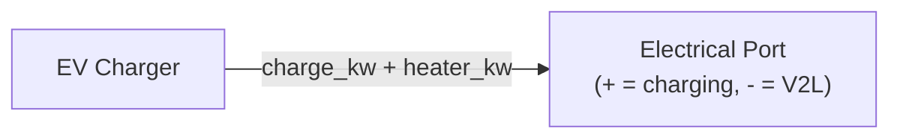

# EV Charger Equipment Model

[Back to Architecture](../architecture.md)

**Source**: `crates/hares-equipment/src/ev/`

The EV charger models Level 1 and Level 2 residential charging with stochastic driving patterns, SOC-dependent charging curves, temperature derating, and vehicle-to-load (V2L) support.

## Charging Model

### Charging Levels

| Level | Power Range | Default |
|-------|-------------|---------|
| L1 | 1.0-1.8 kW | 1.4 kW (12A x 120V) |
| L2 | 3.6-11.5 kW | Capacity-tiered: 1-2 (3.6), 3 (7.2), 4+ (11.5) |

### Power Tapering

- **PyBaMM LUT**: optional CSV/Parquet with (soc, power_fraction) columns for SOC-dependent tapering
- **Temperature derating**: linear ramp from 0% (below `min_charge_temp_c` = 0C) to 100% (above `full_power_temp_c` = 10C)
- **Taper limit**: prevents SOC overshoot: `taper_kw = (soc_limit - soc) * capacity / dt / efficiency`
- Final power = `min(rated, lut_derated, temp_derated, taper_limit, power_limit)`

## Vehicle Archetype

- Capacity: direct config, or `range_miles * 0.325 kWh/mi`, or default 75 kWh
- Charging efficiency: 0.9 default (AC-to-DC)
- SOC limits: `initial_soc` (default 1.0), `soc_max` (default 1.0)

### Driver Archetypes (7 variants)

Stochastic daily driving with log-normal mileage distribution:

| Archetype | Arrival | Duration | SOC | Notes |
|-----------|---------|----------|-----|-------|
| Commuter | 18:00 | 12h | 40% | Standard weekday |
| ShiftWorker | 7am/21pm | 9h | 50% | 14-day rotation |
| WorkFromHome | 15:00 | 6h | 70% | Reduced driving |
| WeekendWarrior | 19:00/21:00 | varies | split | 1.8x weekend mileage |
| SeniorRetiree | 14:00 | 8h | 65% | 0.75x weekend |
| SchoolRunFamily | 9:30/16:30 | varies | varies | Two daily trips |
| SingleCarShared | 17:00/20:00 | varies | 50/50 | Shared household |

## Availability & Plug-In Policy

- Event-based: daily (arrival_minute, duration_minutes, start_soc, weight) sampling
- **Always** policy (default): plugs in whenever in window
- **LowSoc** policy: only plugs in if SOC < threshold (default 0.3)
- Arrival/departure times jittered by configurable fuzz minutes

## Charging Strategy Constraints

Applied in priority order:
1. **Immediate Charge Hold**: if `immediate_target_soc` set and SOC >= threshold, charge blocked until `delay_until_hour`
2. **TOU Peak Avoidance**: charging blocked during peak window `[start_hour, end_hour)` (wrap-around supported)
3. **Ready-By Mandate**: calculates required power to hit `ready_target_soc` by `ready_by_hour`

## V2L (Vehicle-to-Load)

- Enabled via `v2l_enabled` (default false)
- Negative `PowerSetpoint` triggers discharge
- Constraints: SOC > `v2l_soc_reserve` (0.2), max `v2l_max_discharge_kw` (3.0 kW)
- V2G not supported in v1

## Control Signals

| Signal | Effect |
|--------|--------|
| `PowerSetpoint` | Direct charge/discharge target (negative = V2L) |
| `PowerLimit` | Maximum charging power cap |
| `SOCTarget` | Primary SOC goal with optional min/max bounds |

## Port Interactions

- **Electrical only**: `active_power_kw` (positive = load, negative = generation), `reactive_power_kvar = 0`
- No thermal or fuel ports
