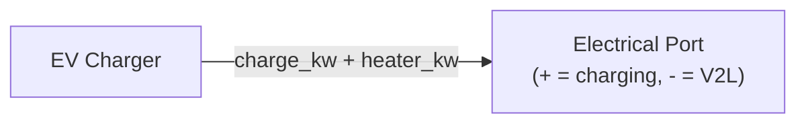

# EV Charger Equipment Model

[Back to Architecture](../architecture.md)

**Source**: `crates/hares-equipment/src/ev/`

The EV charger models Level 1 and Level 2 residential charging with stochastic driving patterns, SOC-dependent charging curves, temperature derating, and vehicle-to-load (V2L) support.

## Charging Model

### Charging Levels

| Level | Power Range | Default |
|-------|-------------|---------|
| L1 | 1.0-1.8 kW | 1.4 kW (12A x 120V) |
| L2 | 3.6-11.5 kW | Capacity-tiered: 1-2 (3.6), 3 (7.2), 4+ (11.5) |

### Power Tapering

- **PyBaMM LUT**: optional CSV/Parquet with (soc, power_fraction) columns for SOC-dependent tapering
- **Temperature derating**: linear ramp from 0% (below `min_charge_temp_c` = 0C) to 100% (above `full_power_temp_c` = 10C)
- **Taper limit**: prevents SOC overshoot: `taper_kw = (soc_limit - soc) * capacity / dt / efficiency`
- Final power = `min(rated, lut_derated, temp_derated, taper_limit, power_limit)`

## Vehicle Archetype

- Capacity: direct config, or `range_miles * 0.325 kWh/mi`, or default 75 kWh
- Charging efficiency: 0.9 default (AC-to-DC)
- SOC limits: `initial_soc` (default 1.0), `soc_max` (default 1.0)

### Driver Archetypes (12 variants)

Stochastic daily driving with log-normal mileage distribution calibrated to
NHTS 2017 VMT data (μ ≈ 3.35, σ ≈ 0.65 for typical ~35 mi/day, CV ≈ 0.73).
Log-normal has natural [0,∞) support, correctly capturing the right-skew
observed in daily VMT without the negative-draw clamping artefact of a
Gaussian parameterisation.

| Archetype | Level | Departure | Duration | Daily mi (mean) | Strategy |
|-----------|-------|-----------|----------|-----------------|----------|
| Daily Commuter L2 | L2 | 08:00 | 10h | 38 | Nightly (22-6, 90% SOC) |
| Daily Commuter L1 | L1 | 08:00 | 10h | 25 | Immediate (100%) |
| Long Commuter L2 | L2 | 07:00 | 11h | 75 | Immediate (100%) |
| WFH Occasional | L2 | 10:00 | 3h | 12/25 wd/we | Low SOC (30%/80%) |
| WFH L1 Minimal | L1 | 10:00 | 2h | 8 | Immediate (100%) |
| Heavy-Use SUV | L2 | 08:00 | 10h | 55 | Nightly (22-6, 90% SOC) |
| Shift Worker | L2 | 06:00 | 9h | 30 | PreDeparture (90%) |
| Weekend Warrior | L2 | 09:00 | 8h | 10/30 wd/we | Low SOC (30%/80%) |
| Workplace Charger | L1 | 08:00 | 10h | 30 | Immediate (100%) |
| Retiree L1 | L1 | 10:00 | 3h | 10 | Immediate (100%) |
| PHEV Commuter | L2 | 08:00 | 10h | 35 | Nightly (22-6, 90% SOC) |
| TOU Optimizer CA | L2 | 08:00 | 10h | 38 | TOU Aware (90%) |

## Availability & Plug-In Policy

- Event-based: daily (arrival_minute, duration_minutes, start_soc, weight) sampling
- **Always** policy (default): plugs in whenever in window
- **LowSoc** policy: only plugs in if SOC < threshold (default 0.3)
- Arrival/departure times jittered by configurable fuzz minutes

## Charging Strategy Constraints

Applied in priority order:
1. **Immediate Charge Hold**: if `immediate_target_soc` set and SOC >= threshold, charge blocked until `delay_until_hour`
2. **TOU Peak Avoidance**: charging blocked during peak window `[start_hour, end_hour)` (wrap-around supported)
3. **Ready-By Mandate**: calculates required power to hit `ready_target_soc` by `ready_by_hour`

## V2L (Vehicle-to-Load)

- Enabled via `v2l_enabled` (default false)
- Negative `PowerSetpoint` triggers discharge
- Constraints: SOC > `v2l_soc_reserve` (0.2), max `v2l_max_discharge_kw` (3.0 kW)
- V2G not supported in v1

## Control Signals

| Signal | Effect |
|--------|--------|
| `PowerSetpoint` | Direct charge/discharge target (negative = V2L) |
| `PowerLimit` | Maximum charging power cap |
| `SOCTarget` | Primary SOC goal with optional min/max bounds |

## Port Interactions

- **Electrical only**: `active_power_kw` (positive = load, negative = generation), `reactive_power_kvar` (signed, positive = absorbing)
- No thermal or fuel ports

### Smart-Inverter Var Control

The EV is an inverter-coupled DER (V2G/V2L via DC-link inverter) and IEEE 1547-2018 / SAE J3072 require reactive capability. The EV supports the same smart-inverter var control as the battery:

| Signal | Behaviour |
|--------|-----------|
| `PowerSetpoint.reactive_power_kvar: Some(q)` | Sets absolute var override (finite values accepted) |
| `ReactiveSetpoint { kvar }` | Direct var setpoint, positive = absorbing |
| `PowerFactorSetpoint { power_factor }` | Sets displacement power factor in `(0, 1]`, zeros `q_setpoint_kvar` |

**Config fields**:
| Field | Default | Meaning |
|-------|---------|---------|
| `power_factor` | `1.0` | Displacement power factor; 1.0 = unity (PFC rectifier baseline, bit-identical to legacy behaviour) |
| `charger_capacity_kva` | `max(max_charging_power_kw, v2g_max_discharge_kw, v2l_max_discharge_kw)` | Apparent-power rating for kVA clamp |

**Precedence** (same as battery):
1. `q_setpoint_kvar` (from `ReactiveSetpoint` or `PowerSetpoint.reactive_power_kvar`) — absolute override, passed through as-commanded
2. `power_factor` baseline: `Q = P · tan(acos(pf))` — sign follows var flow (charging P>0 → Q>0 absorbing; V2G/V2L discharge P<0 → Q<0 supplying)

**kVA clamp**: `|Q| ≤ sqrt(max(0, S² − P²))` with `S = charger_capacity_kva` — active-power priority (P never curtailed for Q).

**Sign convention**: positive = inductive/absorbing vars, negative = capacitive/supplying vars. The same signed value is written to port, CoreOutput, and telemetry (`REACTIVE_POWER_KVAR` key) with no negation.

**Checkpoint**: `q_setpoint_kvar` and `power_factor` are persisted in the EV checkpoint (version 2), so reactive state survives save/load. On load, `reactive_power_kvar` resets to 0.0 (recomputed on next step).

**Default runs are bit-identical**: with `power_factor=1.0` (default), `compute_reactive_kvar` returns 0.0 — pre-existing simulations produce identical real power, energy, and thermal results.

The EV declares `REACTIVE` core capability and `REACTIVE_SETPOINT | POWER_FACTOR_SETPOINT` control capabilities. `CoreOutput.flows.reactive_power_kvar` is `Some(q)` with signed Q matching the port.

For background on why and how other equipment handles reactive power, see [power-factor.md](./power-factor.md).
