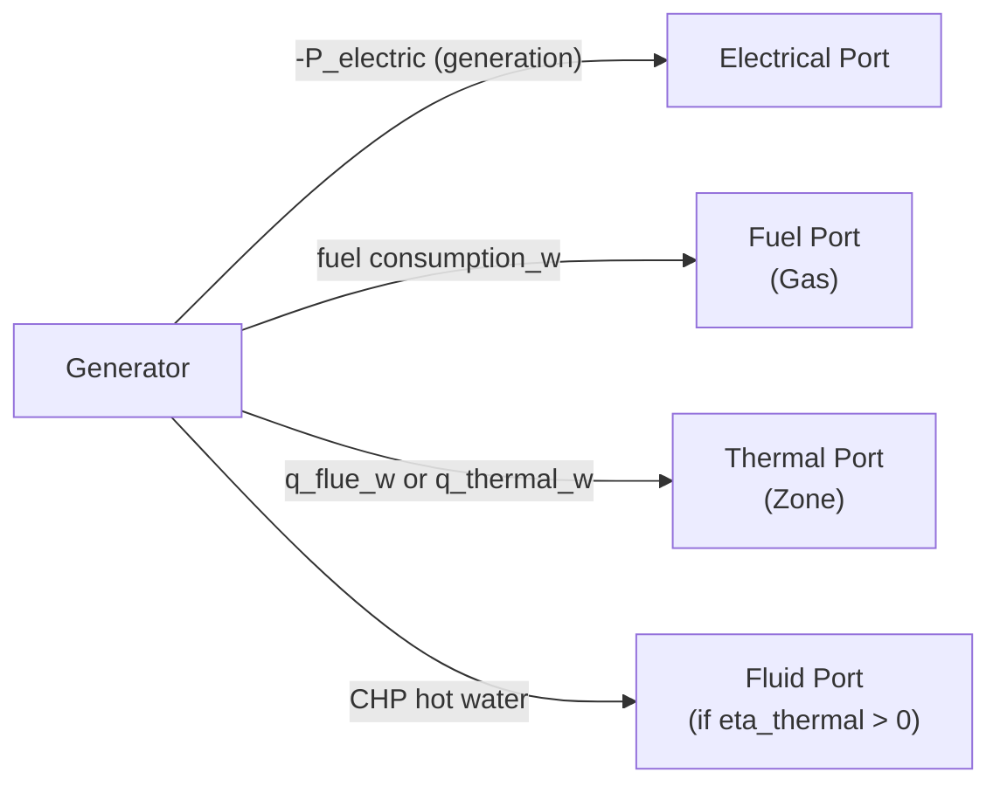

# Generator Equipment Model

[Back to Architecture](../architecture.md)

**Source**: `crates/hares-equipment/src/generator.rs`

The generator model covers gas generators and fuel cells with load-dependent efficiency, CHP thermal recovery, and ramp rate control.

## Efficiency Models

Three load-dependent efficiency curves:

| Model | Formula | Default For |
|-------|---------|------------|
| Constant | `eta = rated_efficiency` | Gas generator (0.30) |
| Piecewise-Linear | Interpolated (capacity_ratio, efficiency_ratio) pairs | Custom curves |
| Quadratic | `eta = rated * (-0.5*cr^2 + 1.5*cr)` (Vishwanathan 2018) | Fuel cell |

Clamped to 0.001 minimum to prevent division by zero.

> **Note on "power_factor" in generator.rs:453**: The local variable `fuel_curve_power_factor` in `compute_stack_cooler_heat()` is the stack-cooler polynomial's power-scaling term for the fuel cell thermal model, NOT the electrical power factor. It has nothing to do with reactive power or the ZIP/PF system documented in [power-factor.md](./power-factor.md).

## Energy Balance

```
P_electric = target_kw (clamped by ramp rate)
P_fuel     = P_electric / eta(capacity_ratio)
Q_thermal  = P_fuel * eta_thermal     (CHP heat recovery)
Q_flue     = P_fuel - P_electric - Q_thermal
```

Constraint: `eta_electric + eta_thermal <= 1.0` (validated at init).

## Start/Stop & Ramp Control

- **Minimum operating power** (`capacity_min_kw`): below min -> shuts off (no partial load below minimum)
- **Ramp rate** (`delta_kw_per_s`): default 1.0 kW/s, applies to power increases only (decreases are instant)

## Control Signals

| Signal | Effect |
|--------|--------|
| `PowerSetpoint` | Explicit generation target, persists until cleared |
| `ModeOverride` | Off: sets power to 0; Standby: clears setpoint |
| `SelfConsumption` | Auto-matches net load with import/export limits |

### Self-Consumption Logic

```
desired_import = clamp(net_load, -export_limit, grid_import_limit)
target = net_load - desired_import
```

## Port Interactions



- **Electrical**: negative = generation. Reactive power is held at zero — detailed synchronous genset excitation and power-factor control is out of scope for this model. See [power-factor.md](./power-factor.md).
- **Fuel**: consumption in watts (FuelType::Gas)
- **Thermal**: waste heat to zone. With CHP fluid loop: only flue loss to zone, thermal recovery to fluid. Without loop: all waste heat to zone
- **CHP Fluid**: water loop at 70C supply / 60C return, 0.1 kg/s default

## Telemetry

`electric_output_kw`, `fuel_input_w`, `eta_electric`, `ramp_limited`, `thermal_output_w` (CHP), `flue_loss_w` (CHP)
