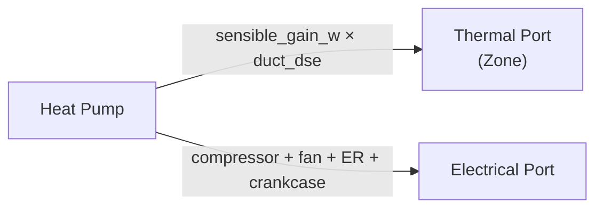
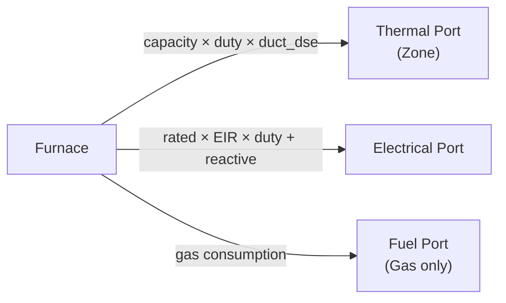

# HVAC Equipment Models

[Back to Architecture](../architecture.md)

HVAC equipment in HARES covers heating, cooling, and dehumidification for conditioned zones. All HVAC models share a common thermostat FSM and duct distribution system, with equipment-specific physics for capacity and efficiency.

## Heat Pump

**Source**: `crates/hares-equipment/src/hvac/heat_pump/`

### Architecture

Heat pumps are split into separate heater and cooler components:
- **ASHPHeater / MinisplitHeater**: Heating mode (includes defrost, backup ER)
- **HpCooler**: Cooling mode (wraps `AirConditioner` with HP-specific overrides)

### Capacity & Performance Curves

Biquadratic curves for both capacity and EIR (Energy Input Ratio) at each speed stage:

```
value = c0 + c1*x1 + c2*x1² + c3*x2 + c4*x2² + c5*x1*x2
```

Where x1/x2 depend on mode:
- **Cooling**: x1 = coil entering wet-bulb (C), x2 = outdoor dry-bulb (C)
- **Heating**: x1 = zone dry-bulb (C), x2 = outdoor dry-bulb (C)

Speed control modes:
- **SingleSpeed**: On/off cycling at rated capacity
- **TwoSpeed**: Setpoint/time/alternating switching between two stages
- **MultiSpeedInterpolated**: Linear interpolation between bracketing stages
- **VariableSpeed**: Ideal modulation to match load

### Part-Load Degradation

Quadratic EIR PLR curves per stage: `EIR_PLR = a + b*PLR + c*PLR²`

Startup ramp (Winkler 2009): exponential degradation over first ~5-6 minutes per stage; disabled for variable-speed. Winkler, J.M. (2009). "Development of a Component Based Simulation Tool for the Steady State and Transient Analysis of Vapor Compression Systems." Ph.D. dissertation, University of Maryland. https://drum.lib.umd.edu/handle/1903/9493

### Defrost Model (Heating Only)

Two modes, both activated when OAT <= 4.4C:

**OnDemand** (humidity-based, default):
- Defrost fraction = `1 / (1 + 0.01446/delta_humidity)`
- Coil outlet temp: `T_coil = 0.82*OAT - 8.589C`
- Capacity multiplier: `0.875 * (1 - time_fraction)`

**Timed** (DOE-2 / EnergyPlus):
- Fixed defrost fraction (~3.5 min/hr)
- Capacity multiplier: `0.909 - 107.33*delta_omega`
- Power multiplier: `0.90 - 36.45*delta_omega`

Both support ReverseCycle or Resistive heat delivery.

### Crankcase Heater

- ASHP default: 50 W @ 12.8C activation threshold
- MSHP default: 15 W @ 0C
- Optional capacity curve: `effective_cap = rated * (c0 + c1*T + c2*T²)`

### Backup/Auxiliary Electric Resistance

Separate capacity + EIR stages with lockout logic:
- **Hard lockout**: ER disabled for configurable duration after setpoint raise
- **Soft lockout**: ER disabled while zone temp is rising (HP is winning)
- **Temperature lockout**: HP locked out below -17.78C; ER locked out below 4.44C
- **Supplemental threshold**: ER disabled when OAT > 21C

### Port Interactions



- Heater: `ThermalCategory::HvacHeating`, applies `duct_dse` and `space_fraction`
- Cooler: negative sensible + latent via SHR split, `ThermalCategory::HvacCooling`
- Electrical: compressor + fan + ER backup + crankcase + pan heater (MSHP), plus reactive power per [power-factor](./power-factor.md)

### Reactive Power

All heat pump types (ASHP, MSHP, GSHP, WSHP) carry `CoreCapabilities::REACTIVE` and report signed reactive power on port, CoreOutput, and telemetry. Reactive power follows Rule R1 (`Q` computed from the already-computed real power — real power remains bit-identical at all voltages) and is computed **per component** (`crates/hares-equipment/src/hvac/reactive.rs`):

```
Q_total = Σ_c  P_c · tan(acos(pf_c)) · reactive_base_c(V)
```

| Component | pf | Source |
|-----------|----|--------|
| Compressor (heating) | 0.84 | Unit ZIP: class default (Hajagos & Danai 1998) or `"zip"` override |
| Compressor (cooling) | 0.96 | Unit ZIP: class default (Hajagos & Danai 1998) or `"zip"` override |
| Indoor blower / outdoor fan | 0.87 | `FAN_MOTOR_ZIP` (OCHRE fans row) |
| Ground/water-loop pump (GSHP/WSHP) | 0.84 | `LOOP_PUMP_ZIP` (PUMPS row) |
| ER backup, crankcase / base-pan heater, resistive defrost | 1.0 | Resistive — Q ≡ 0 by construction |

GSHP/WSHP heaters and coolers use the same compressor PF as their air-source counterparts (identical compressor motor class). Compressor PF is physics, not a control surface.

The per-component split eliminates the former ER-backup phantom-kvar artifact: with a folded whole-unit pf 0.84, a 10 kW resistive ER element was wrongly assigned `0.646 · P_ER` (~6.5 kvar) of reactive power during backup events. Now ER-active timesteps carry only the compressor + fan Q, compressor-only rows are unchanged (`Q/P = tan(acos(0.84))`), ER-only rows carry just the blower Q, and crankcase-only standby draws zero vars — matching real AMI signatures.

**Config semantics**: a user `"zip"` sidecar override (`pf`/`zq`/`iq`/`pq`) retargets the **compressor component only** (the component the class row describes); fan/pump components keep their fixed physical values, and resistive components are always Q ≡ 0. Exception: the `pf = 0.0` sentinel (e.g. `ZipLoad::constant_power()`) disables reactive power for the whole unit, secondary components included. See [power-factor.md](./power-factor.md#hvac-all-types).

All typed HVAC equipment is covered by the class-defaults table in [power-factor.md](./power-factor.md).

### Control & Telemetry

**Capabilities**: `THERMAL_SETPOINT | DUTY_CYCLE | LOAD_FRACTION | POWER_LIMIT | MODE_OVERRIDE | DEMAND_RESPONSE`

**Telemetry**: `electric_kw`, `thermal_output_w`, `operating_mode`, `speed_index`, `defrost_active`, `cop`, `runtime_fraction`, `sensible_cooling_w`, `latent_cooling_w`, `shr`, `reactive_power_kvar`

---

## Furnace

**Source**: `crates/hares-equipment/src/hvac/furnace.rs`

### Variants

- **ElectricFurnace**: 100% electrical heating
- **GasFurnace**: Combustion heating with AFUE efficiency

### Internal Model

- Single-stage rated capacity
- Gas: `thermal_output = fuel_input * AFUE` (flue losses implicit in AFUE)
- Electric: `thermal_output = electrical_input * efficiency`
- Fan power proportional to heating duty
- **Reactive power**: Gas furnace blower fan PF 0.87 (FAN class in [power-factor.md](./power-factor.md)). Electric furnace is per-component: element PF 1.0 (Q≡0, resistive) + blower fan PF 0.87 — Q equals the blower component alone

### Port Interactions



**Telemetry**: `electric_kw`, `thermal_output_w`, `operating_mode`, `supply_air_temp_c`

---

## Boiler

**Source**: `crates/hares-equipment/src/hvac/boiler.rs`

### Variants

- **ElectricBoiler**: Resistance heating
- **GasBoiler**: Combustion with optional condensing mode

### Combustion Model (Gas)

- Efficiency as biquadratic function of PLR and return water temperature
- Condensing mode: different EIR curve coefficients for better low-load performance

### Port Interactions

- **Hydronic loop**: supply/return temperatures, mass flow rate, FluidType (Water/Glycol)
- **Electrical**: pump power plus reactive per [power-factor.md](./power-factor.md)
- **Thermal**: parasitic losses to zone

**Reactive power**: Gas boiler circulation pump PF 0.84 (PUMPS class); electric boiler element PF 1.0 (Q=Some(0.0) — resistive).

**Telemetry**: `electric_kw`, `thermal_output_w`, `operating_mode`, `supply_temp_c`, `return_temp_c`, `reactive_power_kvar`

---

## Air Conditioner

**Source**: `crates/hares-equipment/src/hvac/air_conditioner.rs`

### Variants

- **Central AC**: 312 CFM/ton default (ResStock/OCHRE calibrated)
- **Room AC**: 312 CFM/ton default

### Psychrometric Coil Model

Uses the Apparatus Dew Point (ADP) method:
1. Bypass factor: `BF = exp(-Ao / mass_flow_rate)`
2. Iterative fixed-point solver for ADP temperature
3. Supply air: `T_supply = T_adp + BF * (T_entering - T_adp)`
4. SHR from enthalpy comparison at inlet, ADP, and outlet conditions

### Latent Degradation (Henderson-Rengarajan 1996)

At part load, condensate re-evaporates on off-cycles:
- `effective_SHR = 1 - (1 - steady_state_SHR) * lhr_multiplier`
- Parameters: `twet_rated_s` (~1000s), `gamma_rated` (~1.5), `max_cycling_rate` (~3/hr)
- Fixed-point solver for moisture removal resumption time (20 iterations max)

### Port Interactions

- **Thermal**: negative sensible (cooling) + latent, both with `duct_dse`
- **Electrical**: compressor + fan + crankcase heater, plus reactive power per [power-factor.md](./power-factor.md)

**Reactive power**: per component (`hvac::reactive`): compressor PF 0.96 (HVAC_COOLING class, or `"zip"` override), fan PF 0.87, crankcase heater resistive (Q ≡ 0). Same component PFs across Central AC, Room AC, ASHP/MSHP/GSHP/WSHP cooler; GSHP/WSHP coolers add their loop pump at PF 0.84 (PUMPS class).

**Telemetry**: `electric_kw`, `sensible_cooling_w`, `latent_cooling_w`, `shr`, `cop`, `runtime_fraction`, `reactive_power_kvar`

---

## Thermostat

**Source**: `crates/hares-equipment/src/hvac/thermostat.rs`

### State Machine

Three states: `Heating`, `Cooling`, `Deadband` (default)

### Deadband Logic

Asymmetric offset (OCHRE default 0.2):
- Turn-on = `setpoint - hvac_dir * hysteresis * (1 - offset)`
- Turn-off = `setpoint + hvac_dir * hysteresis * offset`
- Validation: `cooling_setpoint - heating_setpoint >= 2 * hysteresis`

### Setpoint Sources (Priority Order)

1. Runtime override (control signal, sticky)
2. Schedule (per-timestep CSV or 24-hour daily profile)
3. Static base setpoints

Minimum cycle time prevents rapid cycling via `last_mode_switch_at` timestamp.

---

## Dehumidifier

**Source**: `crates/hares-equipment/src/hvac/dehumidifier.rs`

### Operating Model

- On/off based on relative humidity deadband (default +/-0.05 around target)
- Biquadratic performance curves for water removal and energy factor vs (zone DB, RH)
- Actual removal = `rated_water_removal_l_day * fraction_load * multiplier(T, RH)`

### Thermal Effect

- Latent removal: `Q_lat = water_removal_kg_s * latent_heat_vaporization`
- Sensible: dehumidifier heats zone (motor/fan dissipation + latent recovery)
- Net: dehumidification + heat input (cooling system may be needed to offset)

**Telemetry**: `water_removal_l_day`, `electric_power_w`, `latent_removal_w`, `reactive_power_kvar`

**Reactive power**: PF 0.96 (HVAC_COOLING class — compressor behaves like a cooling compressor per [power-factor.md](./power-factor.md)). Deliberately whole-unit, not per-component: the dehumidifier is a sealed appliance whose energy-factor model never splits the small internal fan from the compressor.

---

## Electric Baseboard

**Source**: `crates/hares-equipment/src/hvac/baseboard.rs`

Simple resistive heating: efficiency = 1.0, no capacity curves, no duct losses (`duct_dse = 1.0` always). Direct zone heating with `space_fraction` for multi-zone splits.

**Reactive power**: PF 1.0 (RESISTANCE class), Q=Some(0.0) — pure resistive element per [power-factor.md](./power-factor.md).

**Telemetry**: `electric_kw`, `thermal_output_w`, `operating_mode`, `reactive_power_kvar`

---

## Coil Physics

**Source**: `crates/hares-equipment/src/hvac/coil_physics.rs`

Shared psychrometric cooling coil solver used by AC and heat pump cooler:
1. Mass flow rate from volume flow and moist air density
2. Bypass factor from coil Ao effectiveness
3. Iterative ADP solution via enthalpy balance
4. SHR calculation from inlet/outlet/ADP enthalpies
5. Henderson-Rengarajan latent degradation for part-load cycling

---

## Duct Distribution (ASHRAE 152)

**Source**: `crates/hares-equipment/src/hvac/helpers.rs` -> `hares_physics::ashrae152`

- Direct `duct_dse` config override takes priority
- Dynamic calculation from supply/return duct parameters (leakage fractions, areas, R-values)
- Supply leakage to unconditioned zones reduces delivered capacity
- Return leakage increases infiltration load
- Duct wall conduction accounts for temperature delta between supply air and unconditioned space
