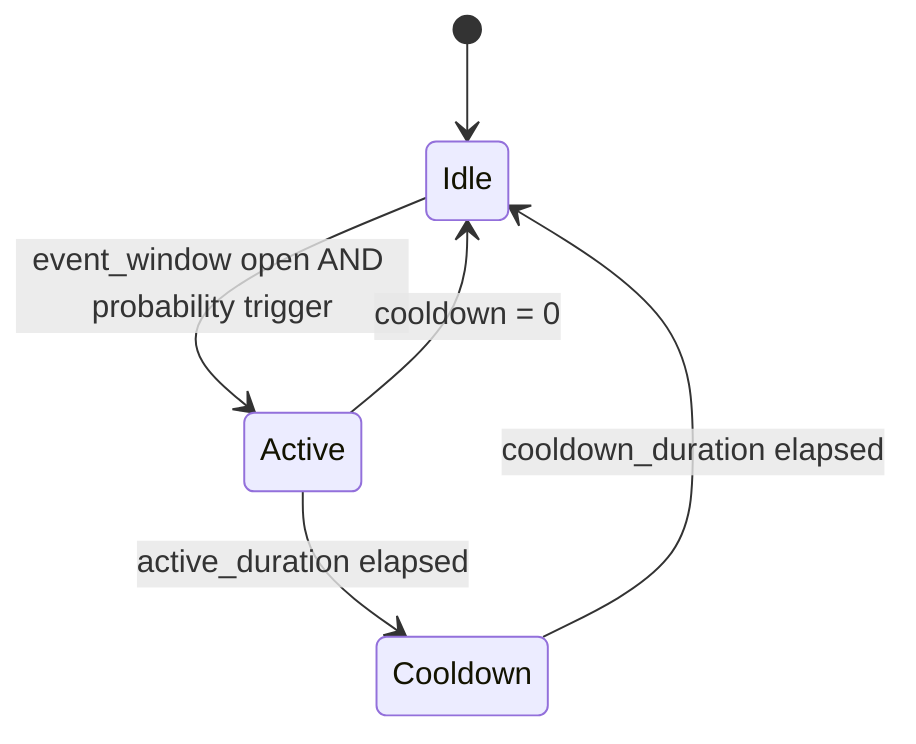

# Scheduled & Event Load Equipment Models

[Back to Architecture](../architecture.md)

## Scheduled Load

**Source**: `crates/hares-equipment/src/scheduled_load.rs`

Deterministic power consumption driven by time-indexed schedules (CSV columns or daily profiles).

### Operating Model

- Power schedule (electrical) + optional gas schedule
- Monthly multipliers for seasonal variation (e.g., ceiling fans off in winter)
- ZIP voltage-dependent load model (full ZIP with byte-identical arithmetic per [power-factor.md](./power-factor.md)):
  ```
  P = P_base * (zp·V² + ip·V + pp)    where V = voltage_pu / v0
  Q = P_actual * tan(acos(pf)) * (zq·V² + iq·V + pq)
  ```
  Default: constant-power (zp=0, ip=0, pp=1.0, pf=0 sentinel → Q=0). Non-zero pf and reactive coefficients from class table when available.

- ScheduledLoad with `ochre_class = "Ventilation Fan"` or `"Ceiling Fan"` now produces the same reactive power as the typed `ventilation.rs` model (both use PF 0.87 from the FAN class — the previous inconsistency is resolved)

### Zone Thermal Routing

Zone assignment by equipment name convention:
- Contains "Exterior"/"Outdoor" -> no zone (outdoor loss)
- Contains "Garage" -> ZoneId(2)
- Contains "Basement" -> ZoneId(3)
- Otherwise -> ZoneId(1) (primary conditioned)

Heat distribution:
- `sensible_gain = (electric_kw * 1000 + gas_w) * sensible_gain_fraction`
- `latent_gain = same * latent_gain_fraction`
- Category: `ThermalCategory::InternalGain`

### Control Signals

| Signal | Effect |
|--------|--------|
| `LoadFraction` | Direct multiplier on output power |
| `ModeOverride(Off)` | Forces zero output |
| `PowerSetpoint` | Overrides schedule for one step |

### Port Interactions

- **Electrical**: `active_power_kw` (schedule x load_fraction x ZIP), `reactive_power_kvar`
- **Fuel**: optional gas consumption
- **Thermal**: sensible + latent to assigned zone

---

## Event-Driven Load

**Source**: `crates/hares-equipment/src/event_load.rs`

Stochastic appliance cycles with probabilistic triggering.

### State Machine



### Event Triggering

- `event_window_source`: schedule controlling when events can start (>0 = open)
- `event_probability_source`: probability of starting per step when window open (0-1)
- `ForcedMode::Active` overrides stochastic draw; `ForcedMode::Idle` blocks start

### Wet Appliance Variant

Multi-phase cycles (e.g., washer: fill -> wash -> spin):
- Array of (power_kw, duration_s) phases
- Optional `hot_water_draw_rate_kg_s` for DHW consumption (writes to `DHW_DEMAND_LOOP`)

### Control Signals

| Signal | Effect |
|--------|--------|
| `LoadFraction` | Multiplies active phase power |
| `ModeOverride(Off)` | Forces Idle |
| `ModeOverride(Standby)` | Starts/holds Active |
| `PowerSetpoint` | Overrides active power for one step |

### Port Interactions

- **Electrical**: phase-based or setpoint-overridden power
- **Thermal**: sensible + latent gains to zone
- **Fuel**: optional if `fuel_type != Electric`
