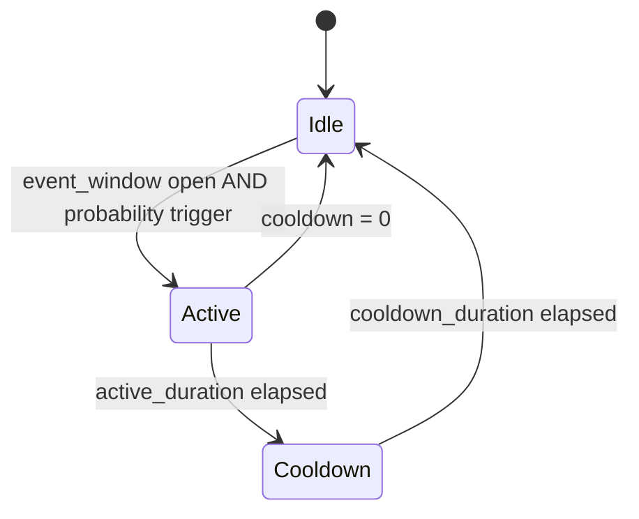

# Scheduled & Event Load Equipment Models

[Back to Architecture](../architecture.md)

## Scheduled Load

**Source**: `crates/hares-equipment/src/scheduled_load.rs`

Deterministic power consumption driven by time-indexed schedules (CSV columns or daily profiles).

### Operating Model

- Power schedule (electrical) + optional gas schedule
- Monthly multipliers (`month_multiplier_0` to `month_multiplier_11`) for
  seasonal variation (e.g., ceiling fans off in winter); they scale the
  electric and gas schedules whatever their source, a daily profile's own
  month factors included
- ZIP voltage-dependent load model (full ZIP with byte-identical arithmetic per [power-factor.md](./power-factor.md)):
  ```
  P = P_base * (zp·V² + ip·V + pp)    where V = voltage_pu / v0
  Q = P_actual * tan(acos(pf)) * (zq·V² + iq·V + pq)
  ```
  Default: constant-power (zp=0, ip=0, pp=1.0, pf=0 sentinel → Q=0). Non-zero pf and reactive coefficients from class table when available.

- ScheduledLoad with `ochre_class = "Ventilation Fan"` or `"Ceiling Fan"` now produces the same reactive power as the typed `ventilation.rs` model (both use PF 0.87 from the FAN class — the previous inconsistency is resolved)

### Zone Thermal Routing

Zone assignment by equipment name convention:
- Contains "Exterior"/"Outdoor" -> no zone (outdoor loss)
- Contains "Garage" -> ZoneId(2)
- Contains "Basement" -> ZoneId(3)
- Otherwise -> ZoneId(1) (primary conditioned)

Heat distribution:
- `sensible_gain = (electric_kw * 1000 + gas_w) * sensible_gain_fraction`
- `latent_gain = same * latent_gain_fraction`
- Category: `ThermalCategory::InternalGain`

### Control Signals

| Signal | Effect |
|--------|--------|
| `LoadFraction` | Direct multiplier on output power |
| `ModeOverride(Off)` | Forces zero output |
| `PowerSetpoint` | Overrides schedule for one step |

### Port Interactions

- **Electrical**: `active_power_kw` (schedule x load_fraction x ZIP), `reactive_power_kvar`
- **Fuel**: optional gas consumption
- **Thermal**: sensible + latent to assigned zone

---

## Event-Driven Load

**Source**: `crates/hares-equipment/src/event_load.rs`

Stochastic appliance cycles with probabilistic triggering.

### State Machine


```mermaid
stateDiagram-v2
    [*] --> Idle
    Idle --> Active: event_window open AND probability trigger
    Active --> Cooldown: active_duration elapsed
    Cooldown --> Idle: cooldown_duration elapsed
    Active --> Idle: cooldown = 0
```

### Event Triggering

- `event_window_source`: schedule controlling when events can start (>0 = open)
- `event_probability_source`: probability of starting per step when window open (0-1)
- `ForcedMode::Active` overrides stochastic draw; `ForcedMode::Idle` blocks start

### Wet Appliance Variant

Multi-phase cycles (e.g., washer: fill -> wash -> spin):
- `phase_len` phases, each `phase_<n>_power_kw`, `phase_<n>_duration_s` and
  optionally `phase_<n>_has_water_draw`; with no `phase_len`, one phase of
  `active_power_kw` for `active_duration_s`
- Optional `hot_water_draw_rate_kg_s` for DHW consumption (writes to `DHW_DEMAND_LOOP`)

### Control Signals

| Signal | Effect |
|--------|--------|
| `LoadFraction` | Multiplies active phase power |
| `ModeOverride(Off)` | Forces Idle |
| `ModeOverride(Standby)` | Starts/holds Active |
| `PowerSetpoint` | Overrides active power for one step |

### Port Interactions

- **Electrical**: phase-based or setpoint-overridden power
- **Thermal**: sensible + latent gains to zone
- **Fuel**: optional if `fuel_type != Electric`

## Parameters and Overrides

**Source**: `crates/hares-equipment/src/raw_params.rs`

Each kind of load (scheduled load, event load, wet appliance) has one list
of the parameters it reads and the kind each is read as (a number, text,
true or false, a list of numbers), beside the constants its code reads them
by; in debug and test builds a read of a key off its list, or as another
kind, fails, so the list cannot fall behind the code. The dwelling's
equipment overrides use the same lists:

- An equipment's own override entry may set only parameters its kind reads,
  `zip` (the ZIP coefficients) aside; any other key, and the reserved
  `equipment_id`, fails the build naming the key and listing what the load
  reads. The HPXML spellings `frac_sensible` and `frac_latent` stand for
  `sensible_gain_fraction` and `latent_gain_fraction`; both spellings of one
  fraction in a layer are an error.
- The wildcard override (`all` or `*`, one of them; both is an error) reaches
  every equipment: each takes the wildcard parameters it reads once every
  override layer is applied (a numbered key such as `phase_4_power_kw` only
  within its family's count; a typed config the fields its schema has) and
  skips the rest. A wildcard parameter no equipment of the dwelling reads
  fails the build.
- A parameter a load reads given a value of another kind (a string for a
  number, a null, an object) fails the build rather than reading as absent.
- A raw-parameter spec of a class with no list (equipment that is not a load,
  added through a blueprint without a typed config) takes the whole wildcard
  and its own entry unchecked, and vouches for no wildcard parameter.

## Grid Outage Behaviour

Scheduled and event-based loads draw nothing and deposit no gains while the
home bus is de-energized; event timers and schedule cursors keep advancing so
missed cycles are not deferred. Gas scheduled loads are also zeroed (modern
gas appliances need electricity for ignition/controls). Islanded homes keep
their loads running. See [outage-behavior.md](../outage-behavior.md).
