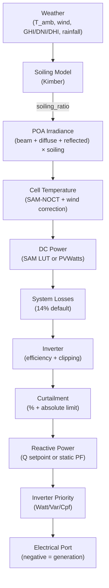
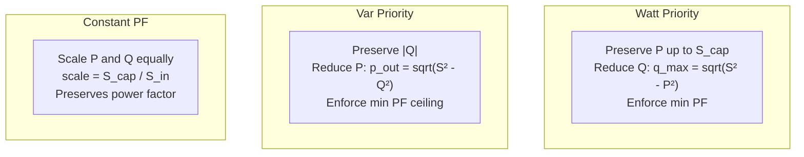

# PV Equipment Model

[Back to Architecture](../architecture.md)

**Source**: `crates/hares-equipment/src/pv/`

The PV model supports multi-array systems with per-surface irradiance tracking, SAM-NOCT cell temperature, Kimber soiling, and full inverter reactive power control.

## DC Power Pipeline



## Array Model

**Source**: `pv/array_config.rs`

- **Single array**: config parsed with unindexed keys (`capacity_kw`, `tilt_deg`, `azimuth_deg`)
- **Multi-array** (via `array_count`): each array indexed as `array_0_*`, `array_1_*`, etc.
- Each array's (tilt, azimuth) quantized to a `surface_id` for irradiance lookup
- Module types: Standard (gamma=-0.0047/C), Premium (-0.0035), ThinFilm (-0.0020)

## Cell Temperature (SAM-NOCT)

```
T_cell = T_amb + (E_POA / 800) * (NOCT - 20) * (9.5 / (5.7 + 3.8 * wind_speed))
```

- Default NOCT = 47C (configurable per array)
- At wind speed = 1.0 m/s, wind correction = 1.0 (baseline)
- Higher wind reduces cell temperature, increasing efficiency

## DC Power Calculation

**PVWatts model** (no LUT):
```
dc_kw = capacity_kw * (irradiance / 1000) * max(0, 1 + gamma * (T_cell - 25))
dc_kw *= (1 - system_losses_fraction)
```

**SAM LUT model** (`pv/lut.rs`):
- 6-axis Parquet lookup table: (month, hour, GHI, DNI, DHI, temp_c) -> ac_kw
- 6D trilinear interpolation across 64 corners with fallback to nearest-neighbor
- Soiling applied as post-LUT derating

## Soiling Model (Kimber)

**Source**: `pv/soiling.rs`

- Rolling 24-hour rainfall accumulation with configurable cleaning threshold (default 6mm)
- Dry period: linear loss rate (default 0.0015/day)
- Grace period: 14 days post-rain where panel stays clean
- Maximum soiling cap: 30%
- Output: `soiling_ratio = 1 - soiling_loss`

## Inverter Priority Modes



Min power factor enforcement (default 0.8) in Watt and Var modes: `|Q| <= |P| * tan(acos(min_pf))`

## Control Signals

| Signal | Effect |
|--------|--------|
| `PowerLimit` | Caps AC output: `p_out = min(p, limit)` |
| `PowerSetpoint` | Treats `active_power_kw` as upper limit; optional Q setpoint |
| `CurtailmentPercent` | Fractional curtailment: `p *= (1 - fraction)` |
| `ReactiveSetpoint` | Sets Q directly (bypasses PF calculation) |
| `PowerFactorSetpoint` | Computes Q from P: `Q = P * tan(acos(pf))` |
| `InverterPriorityMode` | Switches between Watt/Var/Cpf |

Order of application: sum arrays -> curtailment % -> absolute limit -> reactive power -> inverter limits

## Reactive Power

PV supports full reactive control with unified sign convention per [power-factor.md](./power-factor.md): one signed bus Q used identically on port, CoreOutput, and telemetry (positive = absorbing vars, negative = supplying vars). A debug-build validator asserts all three channels agree on every step.

**Control precedence** (highest first):

1. `q_setpoint_kvar` (from `ReactiveSetpoint` or `PowerSetpoint.reactive_power_kvar`) — absolute override
2. PowerFactorSetpoint-updated `power_factor` — clears the `q_setpoint` override (`None`), future steps use updated pf
3. Baseline `PvConfig.power_factor` (default 1.0) — `Q = -|P_gen| · tan(acos(pf))` (generating PV at pf < 1 supplies vars to the bus, making bus Q negative)

**Sign convention**: The default pf=1.0 path produces Q=0 (unchanged from pre-PF behaviour). At pf < 1, the baseline produces negative bus Q because a generating inverter supplies vars. The `ReactiveSetpoint` passes through as-commanded with no sign flip.

**Inverter limits**: Apparent-power rating caps |Q| via inverter priority modes (Watt/Var/Constant PF). Min power factor enforcement (default 0.8).

### Control Signals (Reactive)

| Signal | Effect |
|--------|--------|
| `ReactiveSetpoint { kvar }` | Sets Q directly, bypasses PF calculation. Positive = absorbing |
| `PowerFactorSetpoint { power_factor }` | Updates `self.power_factor`, clears `q_setpoint_kvar` (`None`). Produces `Q = -\|P_gen\| · tan(acos(pf))` |
| `PowerSetpoint.reactive_power_kvar` | Sets `q_setpoint_kvar` as absolute override |
| `InverterPriorityMode` | Switches Watt/Var/Constant PF priority |

## Port Interactions

- **Electrical**: `active_power_kw = -final_p_kw` (generation = negative), `reactive_power_kvar = final_q_kvar` (signed, un-negated — matches CoreOutput and telemetry)
- No thermal or fuel ports

## Telemetry

| Field | Description |
|-------|-------------|
| `dc_power_kw` | Total DC before inverter/curtailment |
| `ac_power_kw` | Final AC output after all limits |
| `reactive_power_kvar` | Signed bus reactive power (positive = absorbing, negative = supplying). Same value on port, CoreOutput, and telemetry |
| `cell_temp_c` | Capacity-weighted mean cell temperature |
| `irradiance_w_m2` | Capacity-weighted mean POA irradiance |
| `curtailment_kw` | Power curtailed by PowerLimit |
| `inverter_clipping_kw` | Power lost to inverter AC capacity |
| `soiling_ratio` | Kimber model output (1.0 = clean) |

## Grid Outage Behaviour

IEEE 1547 anti-islanding: on a de-energized bus the grid-following inverter
trips — no AC export, no DC extraction, no vars. When the home is islanded
on a grid-forming source (battery/generator), the bus stays energized and PV
keeps producing. PV itself is never an island source. See
[outage-behavior.md](../outage-behavior.md).
