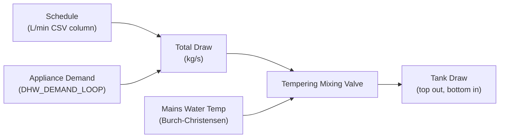
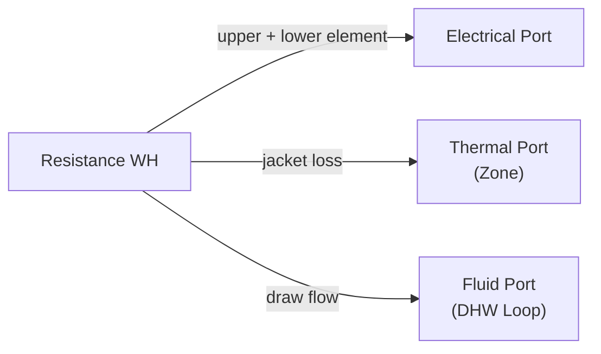
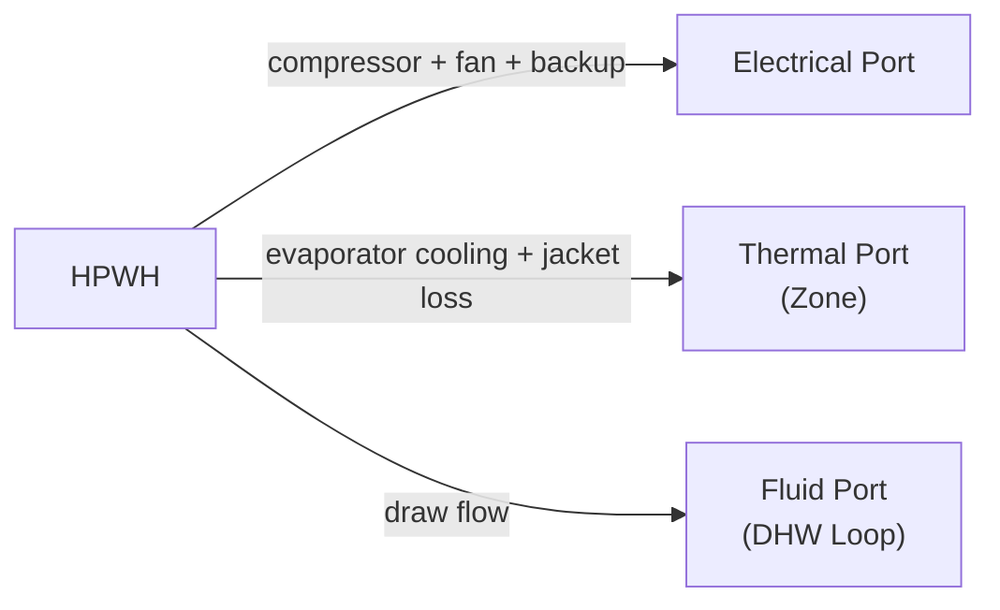

# Water Heater Equipment Models

[Back to Architecture](../architecture.md)

**Source**: `crates/hares-equipment/src/water_heater/`

HARES models four water heater types sharing a common stratified tank model: electric resistance, gas, heat pump (HPWH), and tankless/instantaneous.

## Stratified Tank Model

**Source**: `water_heater/tank.rs`

### Node Discretization

- Configurable 1-12 nodes (default 6), vertical stacking: top=index 0 (hottest), bottom=index n-1 (coldest)
- 2-node special case: OCHRE's 1/3-2/3 volume split (top 1/3, bottom 2/3)
- General case: equal volume distribution
- Within-node mixing is instantaneous (ideal mixing)

### Inversion Handling

Temperature inversions (upper node < lower node) are corrected via PAV (piecewise average volumes) energy-conserving merge. Continues until profile is monotone non-increasing.

### Conduction & End-Cap Losses

- Inter-node vertical conduction: `Q = k * A / dx * dT`
- Per-node skin loss to ambient: UA distributed proportionally to node volume
- End-cap correction: top/bottom nodes get additional UA (default 10% of total each)

### Draw Effect on Stratification

Positive displacement model: water drawn from top, mains injected at bottom. Each node recomputes temperature via volume overlap with shifted water column.

## Hot Water Demand



- Schedule + appliance demand (from wet loads like washers/dishwashers) are summed
- Tempered draw: mixing valve blends tank outlet with mains water to reach fixture temperature
- Two setpoints: `tempered_draw_temp_c` (~40.6C fixture) and `hot_draw_temp_c` (~51.7C dishwasher)
- Unmet load tracked when outlet < fixture setpoint
- Outlet temperature snapshotted pre-step to prevent same-step heat inflation

## Reactive Power

All water heater types carry `CoreCapabilities::REACTIVE` and report signed reactive power on port, CoreOutput, and telemetry. Per-family power factors are defined in the class-defaults table in [power-factor.md](./power-factor.md). The pre-existing port-vs-CoreOutput inconsistency (port had Q from ZIP but CoreOutput was `None`) is fixed — all three channels agree. Reactive power follows Rule R1: `Q = P · tan(acos(pf)) · reactive_base(V)` computed from the already-computed real power.

| WH Type | PF | Notes |
|---------|----|-------|
| Heat Pump WH | 0.97 | Blended on total (compressor + backup + fan) |
| Electric Resistance WH | 1.0 | Pure resistive, Q=Some(0.0) |
| Gas WH | 0.87 | Draft-inducer fan motor |
| Tankless / Gas Tankless | 1.0 | Control electronics only, Q=Some(0.0) |

Checkpoint version 2 on all WH types — `REACTIVE_POWER_KVAR` telemetry persists across save/load round-trips.

---

## Electric Resistance Water Heater

**Source**: `water_heater/resistance.rs`

### Heat Injection

- Upper element (node 0) + lower element (node n-1)
- **MasterSlave** mode (default): upper locks out lower while firing
- **Simultaneous** mode: both can fire concurrently

### Port Interactions



## Gas Water Heater

**Source**: `water_heater/gas.rs`

### Combustion Model

- Burner input: configurable thermal capacity (default 11 kW)
- Efficiency: constant AFUE or polynomial `eta(PLR) = c0 + c1*PLR + c2*PLR^2`
- Flue losses: `flue_loss = gross_heat * flue_loss_fraction` (exits building, default 10%)
- Tank heat: `gross - flue_loss`, further reduced by skin_loss_fraction
- Standing pilot: 150 W thermal default (electronic ignition = 0 W); a
  `pilot_fraction_to_tank` share (default 0.80) heats the tank, the remainder
  goes to the zone

### Draft-Inducer / Power-Vent Fan

`fan_power_w` (config; default `None` → 0 W = atmospheric vent, no blower)
sets the electric draw of the draft-inducer or power-vent blower while the
burner fires. Typical power-vent blowers draw roughly 30-100 W; OCHRE's
gas-tankless reference hardcode uses 65 W on-cycle
(`vendors/OCHRE/ochre/Equipment/WaterHeater.py`). The fan is a vented
parasitic: it contributes real power and Rule R1 reactive power (pf 0.87
fan-motor class row) but adds no heat to the tank or zone.

**HPXML mapping**: the HPXML schema has no standard `WaterHeatingSystem`
element for water-heater fan power, so HARES reads
`WaterHeatingSystem/extension/FanPowerWatts` — the same extension convention
used for HVAC systems (and by OCHRE's HPXML parser). The optional `units`
attribute is checked at the hares-io boundary (`W` default per the element
name; `kW` converted; anything else rejected with a warning). Absent → 0 W,
leaving existing simulations unchanged.

### Port Interactions

- **Fuel**: `burner_input_w + pilot_power_w`
- **Electrical**: draft-fan power only, while the burner fires (real + Rule R1 reactive)
- **Thermal**: `standby_loss * skin_loss_fraction` (jacket portion, not flue)
- **Fluid**: DHW loop

## Heat Pump Water Heater (HPWH)

**Source**: `water_heater/heat_pump_wh.rs`, `water_heater/hpwh_compressor.rs`

### COP & Capacity Curves

Biquadratic functions of wet-bulb temperature and tank average temperature:
```
COP(wb, T_tank) = c0 + c1*wb + c2*wb^2 + c3*T_tank + c4*T_tank^2 + c5*wb*T_tank
```

### Condenser Heat Distribution

12-node default: bottom-biased OCHRE-calibrated weights `[0,0,0,0,0,5,10,15,20,25,30,5] / 110`

### Evaporator Cooling Effect

- Removes sensible heat from zone at SHR (default 0.88)
- Zone sensible gain = `-Q_evap * SHR` (cooling effect)
- Latent loss = `Q_evap * (1 - SHR)`

### Compressor Control

- Mutual exclusion (default) vs. simultaneous with backup element
- Ambient bounds: 7.2C-43.3C standard; 2.8C-62.8C low-power
- Minimum on-time: 600s default (prevents short-cycling)
- Backup element: fires at setpoint - offset (default 8C), 4500W default

### Composite Control Temperature

Weighted average: `0.75 * T_upper_node + 0.25 * T_lower_node` (OCHRE convention for usable energy representation)

### Port Interactions



## Tankless / Instantaneous

**Source**: `water_heater/tankless.rs`

- On-demand heating with no storage
- Capacity-limited: over-capacity -> reduced outlet temperature
- Gas tankless: fuel input = `thermal_output / efficiency` + parasitic (7.38W ANSI RESNET 301)
- Electric tankless: electrical input = `thermal_output / efficiency`

## Grid Outage Behaviour

Outages are signalled by `env.grid.voltage_pu == 0.0` and are gated **at the
root of dispatch** (control/element level), never by merely zeroing the
reported electric draw — tank energy change always equals delivered heat
minus losses:

| WH Type | During outage | Notes |
|---------|---------------|-------|
| Electric Resistance | Elements off: no tank heat, 0 W metered | Tank evolves exactly as if forced Off; hysteresis resumes on restoration |
| Heat Pump WH | Compressor, backup element, and standby parasitic off | Off-timer keeps advancing, so min-off-time is honoured at restoration |
| Electric Tankless | Cannot fire: outlet = inlet, 0 W metered | Resumes on restoration |
| Gas / Gas Tankless | Burner and pilot keep firing; electric parasitics (draft fan, ignition controller) drop to 0 W | Modelling simplification: a real power-vent unit would lock out without draft proving; HARES follows OCHRE in keeping gas water heating available when islanded |
| Indirect Tank | Unaffected | No electrical port; heat comes from the boiler loop |

## Demand Response Levels

All storage water heaters implement DR response:

| Level | Setpoint Offset | Load Fraction | Backup |
|-------|----------------|---------------|--------|
| Normal | 0C | 1.0 | Yes |
| Moderate | -3C | 1.0 | Yes |
| High | -6C | 0.8 | Yes |
| Critical | -10C | 0.5 | Yes |
| GridEmergency | 0C | 0.0 (full shed) | Locked out |

Duration auto-revert: timer decrements each step, reverts to Normal on expiration.

## Control Signals

| Signal | Effect |
|--------|--------|
| `ThermalSetpoint` | Override heating setpoint + deadband |
| `DutyCycle` | On fraction override |
| `ModeOverride` | Force Off/Heating/BackupElement |
| `LoadFraction` | Transient power multiplier (resets each step) |
| `PowerLimit` | Cap electrical/thermal input |
| `DemandResponse` | Level + optional duration (auto-revert) |

Safety cutout: if ANY node > `max_tank_temp_c`, all elements forced off until cooled.
