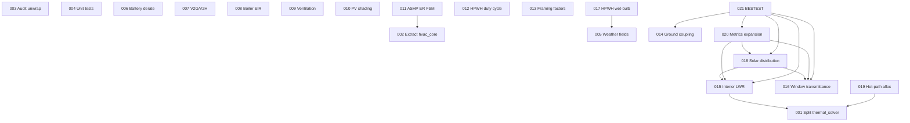

# OCHRE Parity & EnergyPlus-Grade Physics Tickets

Source: [OCHRE Parity Gaps](../equipment/ochre-parity-gaps.md)

Goal: Close all Critical and High gaps, targeting **EnergyPlus-grade or better** physics where possible — not just OCHRE parity. OCHRE is the floor; EnergyPlus Engineering Reference is the ceiling.

## Prerequisite: THERMAL and WEATHER Tickets

All THERMAL-001 through THERMAL-008 and WEATHER-001 through WEATHER-006 complete **before** PARITY work begins. Key impacts:

| Completed Ticket | Effect on PARITY |
|------------------|------------------|
| THERMAL-002 (4-component exterior LWR) | PARITY-015 builds on improved `longwave_radiation.rs` |
| THERMAL-003 (pre-refactor cleanup) | PARITY-001 has less cleanup work; `resolve_internal()` already phased |
| THERMAL-005 (Crank-Nicolson implicit solver) | PARITY-019 reduced to a final sweep (stepping is already zero-alloc) |
| THERMAL-006a (semi-implicit infiltration) | PARITY-001 must account for new resolve flow (h_inf conductances → modified CN step); PARITY-019 must verify per-step LU alloc-free |
| THERMAL-004 (interior LWR tests) | PARITY-015 has baseline tests to extend |
| THERMAL-001 (dry air density) | PARITY-005 becomes audit-only for infiltration |
| WEATHER-006 (DST scheduling) | No PARITY impact (independent) |
| WEATHER-008 (dynamic ground albedo) | PARITY-016 must coordinate with modified `solar.rs` (albedo parameter added to Perez/Liu-Jordan) |
| WEATHER-009 (Berdahl-Martin sky emissivity) | PARITY-005 sky temp audit is now verification-only (models already implemented) |
| WEATHER-010 (full-pipeline integration test) | PARITY-004 focuses on unit tests only (integration coverage already handled) |

## Sequential Execution Order

Tickets are numbered in the order they should be executed. Dependencies are explicit — a ticket may only depend on lower-numbered tickets.

### Phase 0: Quality Foundation (001–004)

Refactor oversized files and establish quality baseline before adding new physics.

| # | Title | Scope | Status |
|---|-------|-------|--------|
| [001](PARITY-001.md) | Split thermal_solver/mod.rs (3107→5 files) | hares-envelope | DONE |
| [002](PARITY-002.md) | Extract hvac_core.rs sub-modules (2749→3 files) | hares-equipment | DONE |
| [003](PARITY-003.md) | Audit unwrap() calls, add proper error handling | all crates | DONE |
| [004](PARITY-004.md) | Unit test coverage for physics modules (50+ tests) | hares-physics, hares-envelope | DONE (superseded by THERMAL/WEATHER) |

### Phase 1: Independent Feature Work (005–016)

No cross-ticket dependencies. Each closes one gap from the parity analysis.

| # | Title | Gap | Scope | Status |
|---|-------|-----|-------|--------|
| [005](PARITY-005.md) | Weather derived fields audit & fixes | High-11 | hares-core, hares-io | DONE (verified, superseded by THERMAL/WEATHER) |
| [006](PARITY-006.md) | Battery temperature-dependent capacity derating | Critical-5 | hares-equipment | DONE |
| [007](PARITY-007.md) | V2G / V2H enablement (battery + EV) | Critical-6 | hares-equipment | DONE |
| [008](PARITY-008.md) | Boiler dynamic EIR curves (verify/complete) | High-7 | hares-equipment | DONE (verified, already implemented) |
| [009](PARITY-009.md) | Ventilation fan / HRV / ERV equipment | High-8 | hares-equipment, hares-io | DONE |
| [010](PARITY-010.md) | PV near-shading model | High-10 | hares-equipment | DONE |
| [011](PARITY-011.md) | ASHP backup ER control FSM | Medium-15 | hares-equipment | DONE (verified, already implemented) |
| [012](PARITY-012.md) | HPWH HP/ER independent duty cycle control | Medium-16 | hares-equipment, hares-types | DONE |
| [013](PARITY-013.md) | Framing factor / parallel-path U-value | Medium-14 | hares-envelope, hares-io | DONE |
| [014](PARITY-014.md) | Ground coupling: RC-based foundation model | Critical-4 | hares-physics, hares-envelope, hares-io | DONE |
| [015](PARITY-015.md) | Interior LWR: Iterative T^4 ScriptF solver | Critical-1 | hares-envelope | DONE |
| [016](PARITY-016.md) | Window transmittance: EnergyPlus polynomial curves | Critical-2 | hares-physics, hares-envelope | — |

### Phase 2: Integration (017–019)

Depend on Phase 1 outputs.

| # | Title | Gap | Scope | Depends On |
|---|-------|-----|-------|------------|
| [017](PARITY-017.md) | HPWH wet-bulb COP input | High-9 | hares-equipment | 005 |
| [018](PARITY-018.md) | Solar distribution to interior surfaces | Critical-3 | hares-envelope | 015, 016 |
| [019](PARITY-019.md) | Eliminate hot-path allocations in thermal solver | Quality | hares-envelope, hares-core | 001 |

### Phase 3: Validation (020–021)

Depend on all physics being in place.

| # | Title | Gap | Scope | Depends On |
|---|-------|-----|-------|------------|
| [020](PARITY-020.md) | Output metrics expansion (25+ metrics) | High-12 | hares-io, hares-core | 015, 016, 018 |
| [021](PARITY-021.md) | BESTEST validation harness (ASHRAE 140) | Medium-25 | tests | 014, 015, 016, 018, 020 |

## Dependency Graph

## Quality Standards (Apply to ALL tickets)

Every ticket must satisfy these before merge:

1. **DRY**: No duplicated logic. Extract shared physics into `hares-physics`. Shared types into `hares-types`.
2. **Separation of concerns**: Physics equations in `hares-physics`/`hares-envelope`. Config parsing in `hares-io`. Equipment behavior in `hares-equipment`. No mixing.
3. **SI units internally**: All parameters/variables use SI with descriptive suffixed names (`capacity_w`, `flow_rate_kg_s`, `resistance_m2_k_w`). Imperial only at I/O boundaries.
4. **Zero hot-path allocation**: No `Vec::new()`, `.collect()`, `Box::new()`, or `.clone()` of large types inside `step()`, `resolve()`, or `run_timestep()`. Use pre-allocated buffers with swap pattern.
5. **Helpful errors**: `Result<T, HaresError>` return types. Error messages include context (equipment name, zone ID, parameter name). No `unwrap()` in production hot paths.
6. **Test coverage**: Every new public function gets at least one unit test. Physics functions validated against EnergyPlus/ASHRAE reference values with `approx::assert_relative_eq!`. Integration tests verify end-to-end behavior.
7. **File size**: No file > 1000 lines. If approaching, extract a sub-module.
8. **Function size**: No function > 80 lines. If approaching, extract helpers.
9. **Channel-based communication**: Equipment <-> solver communication only via `PortSlots` accumulation. No direct references between equipment and solver structs.
10. **Naming**: `snake_case` for all Rust identifiers. Physics variables match EnergyPlus/ASHRAE naming where applicable. No single-letter variables outside tight math loops.
